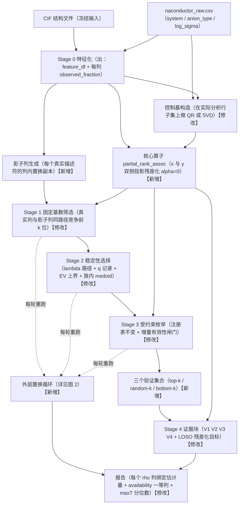
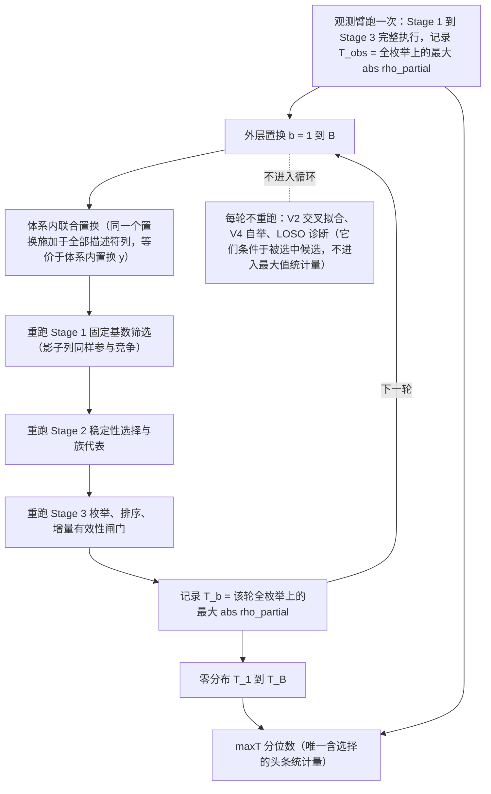
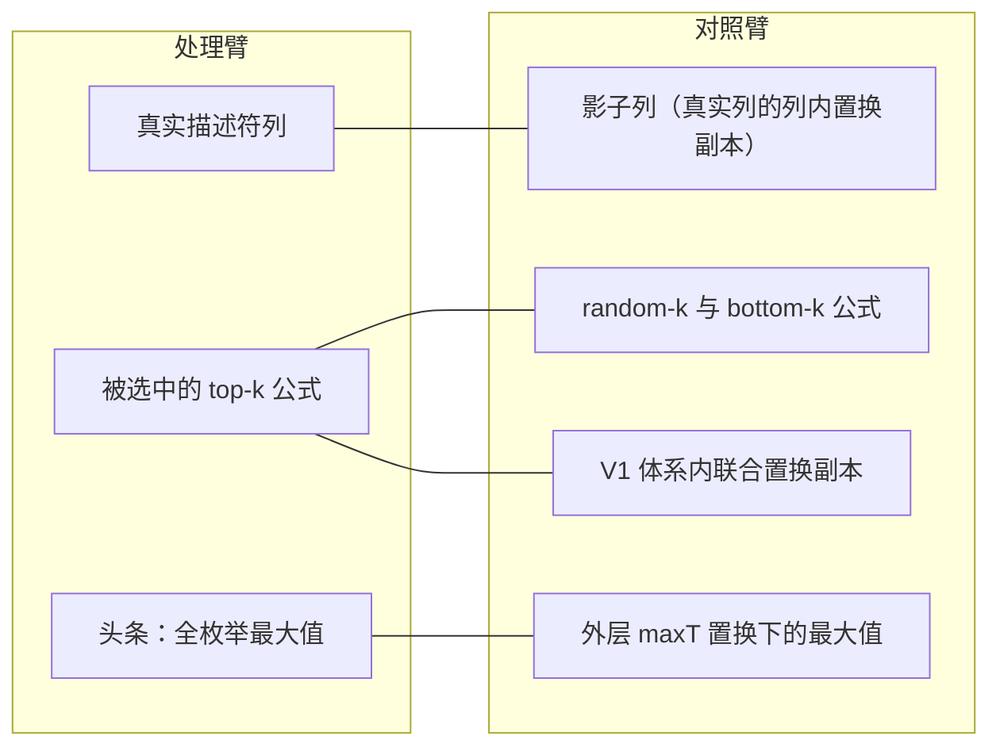

**评审 rubric**：本轮不是评审，是工程规划。判据仍锚定第 1 轮的算法评估，不因"实施成本高"而下调某项的必要性——成本单独在工作量列体现。凡我判定为"删掉功能"而非"修复功能"的，直接写在删除清单里。

---

# 问题 1：修复路线图

## 开篇一条时序约束（比任何单项修复都重要）

**凡是需要设定阈值、基数、闸门、λ 范围的修复项，必须在看到数据之前完成并冻结取值。** 否则这轮修复会精确重演 run01 F 项的失败模式——`errata P3` 之所以是致命证据，不是因为 0.3 这个数字错，而是因为它是看过输出后定的。你现在处在一个**极其罕见的有利位置：数据集还没准备好**。这个窗口一旦关闭就不可恢复。因此路线图的排序原则不是"从易到难"，而是**"先做那些一旦推迟到数据之后就永久失去可信度的项"**。

第二条：**全部 24 项的代码实现都不需要数据集**。只有 5 项的参数取值需要数据，且其中 3 项必须在数据前冻结（下面单独标注）。所以"等数据集"不是任何一项的正当推迟理由。

---

## Wave 0：冻结地基（4 项，必须最先，全部数据前）

### W0-1 配置单一真值源 + seed 派生 + y 掩码契约统一
- **对应**：Cross-Cutting #9、E1、run01 H1/H3
- **阻塞性**：**blocking**——不改这个，你无法确认后面 23 项里任何一项是否真的生效
- **工作量**：M
- **不改的后果**：改 YAML 不改行为；`--seed` 不传到 CV；Stage 1 逐描述符掩 y、Stage 2 不掩、Stage 4 掩，三个阶段的统计量算在不同行总体上再互相比较。任何后续修复的"生效验证"都是自欺
- **数字方向**：→ 中性

### W0-2 一次性删除清单（不是修复，是删除）
- **对应**：A3 / A4 / C2 / D1c / B1 / run01 D5-D6
- **阻塞性**：independent，但越早越好（每删一个就少一个后续修复项）
- **工作量**：S
- **删什么**：`system_proxy_ratio`、`_classify_descriptor` 四分类标签、`deconf_p`、`composite_score`、`signal_retention`、`above_noise_baseline`（在 W3-2 完成前）、单列 X 上的 Ridge/StandardScaler 包装、`_formula_dimensionally_valid`、`_one_hot_encode`、`anion_stratified_cv` 与 `repeated_subsample` 两条 CV 策略、YAML 里的 `deconfound.method: dml` 与 `evaluation.secondary` 中不存在的指标
- **不改的后果**：报表里继续存在 6 个无估计量的数字
- **数字方向**：↓ 变弱（可展示的数字减少一半以上）

### W0-3 估计量命名与 schema 绑定
- **对应**：Cross-Cutting #1、D6b
- **阻塞性**：**blocking**——唯一能把语义错误转成机械可检 schema 错误的改动
- **工作量**：M
- **不改的后果**：五个不同估计量继续共用 "spearman" 一名并列、相减、配区间
- **数字方向**：→ 中性

### W0-4 未执行的计算一律 NaN，禁止有利默认值
- **对应**：Cross-Cutting #5、A2b、A3、D6c
- **阻塞性**：independent
- **工作量**：S
- **不改的后果**：回退 → "最纯物理信号"；NaN → "体系代理"；全块不可用仍标 `exploratory`。**计算失败被报告为科学结论**
- **数字方向**：↓ 变弱

---

## Wave 1：调整层正确性（5 项，可与 Wave 0 并行，全部数据前）

### W1-1 alpha=0 投影替代 Ridge 收缩
- **对应**：A2、D3、Cross-Cutting #2、Top 3 #2
- **阻塞性**：**blocking**——所有自称"去混杂"的数字在此之前都是有偏的，且偏差方向一致有利于结论
- **工作量**：S
- **不改的后果**：组均值被收缩，欠调整随组变小加剧；结果依赖参考类字母序
- **数字方向**：**↓↓ 大幅变弱**——全表最主要的数字下降来源

### W1-2 控制基在实际分析行子集上重算
- **对应**：A1
- **阻塞性**：depends on W1-1
- **工作量**：S
- **不改的后果**：秩在全样本算一次、残差化用行子集，元数据描述的设计与实际拟合的设计不一致
- **数字方向**：→ 中性

### W1-3 残差方差占比作为一等列
- **对应**：A2 退化条件
- **阻塞性**：independent
- **工作量**：S
- **不改的后果**："调整后已无剩余变异"与"剩余变异中有强关系"不可区分
- **数字方向**：→ 中性

### W1-4 族代表改为 y-无关的族内 medoid
- **对应**：B2
- **阻塞性**：independent
- **工作量**：S
- **不改的后果**：代表是族内 |ρ| 的次序统计量，零假设下期望高于典型值且随族成员数单调增大
- **数字方向**：↓ 变弱

### W1-5 秩顺序约定：改名 或 换成秩偏相关
- **对应**：A2、Cross-Cutting #7
- **阻塞性**：independent；建议本轮只做改名版
- **工作量**：改名 S / 换算法 L
- **不改的后果**：当前统计量对 x 的单调变换不不变，与选用 Spearman 的全部理由矛盾
- **数字方向**：改名 → 中性；换算法 ↓ 变弱且历史值不可比

---

## Wave 2：纯函数化（1 项，唯一的 L，是 Wave 3/5 的硬前置）

### W2-1 Stage 1-3 重构为纯函数
- **对应**：E1、Top 3 #1
- **阻塞性**：**blocking for W3-1 / W3-2 / W5-1**
- **工作量**：**L**（1 周以上）
- **不改的后果**：管线无法在置换样本上重跑，永远拿不到含选择的零分布
- **数字方向**：→ 中性（重构本身不改数字；它解锁的东西会大幅改数字）

---

## Wave 3：零分布与对照（6 项，Top 3 的主体）

### W3-1 外层体系内联合置换 maxT
- **对应**：E1、Top 3 #1、G/多重性全部
- **阻塞性**：depends on W2-1
- **工作量**：M
- **不改的后果**：头条数字是"在数据决定的搜索路径上取的最大值，并在定义该路径的同一批数据上求值"，其零分布无人计算
- **数字方向**：**↓↓ 可能决定性变弱**——唯一能证伪或支撑头条的量

### W3-2 影子列替换高斯噪声列，且走完全相同的 Stage 1 路径
- **对应**：B1、Cross-Cutting #4、Top 3 #3
- **阻塞性**：depends on W2-1
- **工作量**：M
- **不改的后果**：对照臂是无缺失、无互相关、未过目标筛的高斯列，处理臂是已过 Stage 1 的幸存者，两臂不可交换
- **数字方向**：↓ 变弱（基线抬高，通过者减少）。**在此项完成前，`above_noise_baseline` 应保持删除状态**

### W3-3 Stage 1 用固定基数替代阈值
- **对应**：A4、D1a、Cross-Cutting #8
- **阻塞性**：depends on W2-1
- **工作量**：S
- **改什么**：删掉 0.2/0.3/0.7 三个阈值，改为"按 |rho_partial| 取固定前 k 位"，k 在看数据前声明并冻结
- **不改的后果**：阈值零外部依据；有效检验假设数管线自己也不知道
- **数字方向**：→ 中性偏 ↓
- **⚠ 必须数据前冻结取值**

### W3-4 V1 共享置换 + 在置换上重算主指标 + p 值定义修正
- **对应**：D2
- **阻塞性**：independent
- **工作量**：S（核心是一行：`perm = rng.permutation(idx)` 复用于全部分量）
- **不改的后果**：各分量独立置换破坏分量间联合依赖；零分布算的是原始 rho 而排序用的是去混杂 rho
- **数字方向**：↓ 变弱
- **亮点保留**：体系内置换这个构思本身是全代码库最正确的一处

### W3-5 组合增量有效性闸门 + 记录 m_enum / n_valid
- **对应**：D1、Cross-Cutting #8
- **阻塞性**：independent
- **工作量**：S
- **改什么**：候选必须在同一支持集上超过其自身分量才准进入排序
- **不改的后果**：a+b 在量级悬殊时 rho ≈ rho(a)，枚举大量产出与其支配分量统计上不可区分的"组合"
- **数字方向**：**↓↓ 大幅变弱**——"最佳组合"这个交付物可能整体消失

### W3-6 random-k / bottom-k 对照验证集
- **对应**：D6d、Top 3 #3
- **阻塞性**：independent
- **工作量**：S
- **不改的后果**：读者没有任何"非入选候选的 V1-V4 长什么样"的参照分布
- **数字方向**：**信息量最高的一项**。如果 bottom-k 的证据画像与 top-k 相似，整个证据基础当场坍塌

---

## Wave 4：证据块估计量对齐（6 项，彼此完全并行）

### W4-1 V2 改为双侧折外残差化（DML 正交得分）+ 逐折 Fisher-z
- **对应**：D3
- **阻塞性**：independent
- **工作量**：M
- **不改的后果**：当前只残差化 y 不残差化 x，不是 Neyman 正交；欠调整的收益恰好流向体系代理型描述符
- **数字方向**：↓ 变弱

### W4-2 V2 未见类别显式处理
- **对应**：D3 退化条件
- **阻塞性**：independent
- **工作量**：S
- **不改的后果**：训练折未见的稀有 anion 类被整行编 0 = 静默当作参考类
- **数字方向**：↓ 变弱

### W4-3 V3 最小 n 闸门 + 小 n 精确置换 p + Fisher-z 合并 + Q/I²
- **对应**：D4
- **阻塞性**：independent
- **工作量**：S
- **不改的后果**：n=3 的体系 Spearman 只能取 {±1, ±0.5}，|rho|≥0.5 恒成立——小体系在结构上无法报出弱证据
- **数字方向**：↓ 变弱
- **⚠ 最小 n 闸门必须数据前冻结取值**

### W4-4 V4 自举主指标 + BCa
- **对应**：D5
- **阻塞性**：depends on W1-1
- **工作量**：S
- **不改的后果**：区间属于原始池化 rho，却被标为该行唯一的 uncertainty_method——最容易被误读的一处
- **数字方向**：↓ 变弱（区间变宽）。即使修好仍不含选择不确定性

### W4-5 CV 层瘦身
- **对应**：C1、C2
- **阻塞性**：independent
- **工作量**：M
- **改什么**：删 anion_stratified_cv 与 repeated_subsample；只保留 LOSO，改在折内残差化目标上计算，报折间离散度
- **不改的后果**：单列 X 下 Spearman(y_val, y_hat) = sign(a)·Spearman(y_val, x_val)，三条"策略"是同一估计量的三种抽样
- **数字方向**：↓ 变弱
- **⚠ LOSO 之外是否还需要 anion 分组 CV，取决于阴离子类计数——可行性判断需要数据**

### W4-6 稳定性选择加 λ 路径 + q 记录 + E[V] 上界
- **对应**：B1
- **阻塞性**：independent
- **工作量**：M
- **不改的后果**：单一 alpha 下选中频率退化为 |边际相关| 的软阈值化平滑函数；不记录 q 则 MB 的 E[V] 事后也无法计算
- **数字方向**：**↑ 频率数字变强**（路径最大值 ≥ 单点频率），但配套的 E[V] 上界会首次暴露实际错误率。全表唯一一项"数字变强"
- **⚠ λ 路径范围需要数据（可用 lasso_path 自动网格规避）**

---

## Wave 5：选择不确定性上限（2 项，最后）

### W5-1 外层嵌套 LOSO，内层完整重跑 Stage 1-3
- **对应**：E1、run02 H
- **阻塞性**：depends on W2-1
- **工作量**：M
- **不改的后果**：`selection_uncertainty_included: False` 继续在 `validate()` 扁平化时被丢弃
- **数字方向**：↓ 变弱，且**交付物性质改变**——嵌套 CV 验证的是"这个流程"的泛化能力，不是"某个描述符"的真实性。这是设计层取舍

### W5-2 相关簇分组选择
- **对应**：B1 退化条件
- **阻塞性**：independent
- **工作量**：M
- **不改的后果**：Lasso 每次子样本任选簇内一个，频率被摊薄到整簇之下阈值——最可复现的物理最容易被判为不稳定
- **数字方向**：↑ 稳定性频率变强，但需要新的聚类阈值参数（**必须数据前冻结**）

---

## 时序、并行与数据依赖总表

| Wave | 项目 | 阻塞性 | 工作量 | 数字方向 | 数据依赖 |
|---|---|---|---|---|---|
| 0 | W0-1 配置真值源 | blocking | M | → | 无 |
| 0 | W0-2 删除清单 | independent | S | ↓ | 无 |
| 0 | W0-3 估计量命名 | blocking | M | → | 无 |
| 0 | W0-4 NaN 纪律 | independent | S | ↓ | 无 |
| 1 | W1-1 alpha=0 投影 | blocking | S | ↓↓ | 无 |
| 1 | W1-2 子集控制基 | dep W1-1 | S | → | 无 |
| 1 | W1-3 残差方差占比 | independent | S | → | 无 |
| 1 | W1-4 medoid 代表 | independent | S | ↓ | 无 |
| 1 | W1-5 秩顺序改名 | independent | S | → | 无 |
| 2 | W2-1 纯函数化 | **blocking** | **L** | → | 无 |
| 3 | W3-1 外层 maxT | dep W2-1 | M | ↓↓ | 无 |
| 3 | W3-2 影子列同路径 | dep W2-1 | M | ↓ | 无 |
| 3 | W3-3 固定基数筛选 | dep W2-1 | S | → | **取值须数据前冻结** |
| 3 | W3-4 V1 共享置换 | independent | S | ↓ | 无 |
| 3 | W3-5 增量有效性闸门 | independent | S | ↓↓ | 无 |
| 3 | W3-6 对照验证集 | independent | S | 信息量最高 | 无 |
| 4 | W4-1 V2 正交得分 | independent | M | ↓ | 无 |
| 4 | W4-2 未见类别 | independent | S | ↓ | 无 |
| 4 | W4-3 V3 升级 | independent | S | ↓ | **闸门须数据前冻结** |
| 4 | W4-4 V4 BCa 主指标 | dep W1-1 | S | ↓ | 无 |
| 4 | W4-5 CV 瘦身 | independent | M | ↓ | 可行性判断需数据 |
| 4 | W4-6 λ 路径 + EV | independent | M | ↑（唯一） | 网格可自动 |
| 5 | W5-1 嵌套 LOSO | dep W2-1 | M | ↓ | 无 |
| 5 | W5-2 簇分组选择 | independent | M | ↑ | **阈值须数据前冻结** |

**并行分组**：
- **并行组 α（第 1 天起）**：W0-2、W0-4、W1-1、W1-3、W1-4、W1-5、W3-4、W3-5 —— 全是 S，互不依赖
- **并行组 β**：W0-1、W0-3 —— 两个 M，建议串行做以免冲突
- **关键路径**：W2-1（L）→ W3-1 / W3-2 / W3-3 / W5-1。**整个路线图的工期由 W2-1 单独决定**
- **并行组 γ（W2-1 进行期间可并行）**：整个 Wave 4 的 6 项，加 W3-6

**一条自检**：修复后如果头条数字**没有明显下降**，那说明修复没生效或改错了地方。上表 24 项里只有 1 项预期让数字变强，其余全部指向下降。这个方向一致性本身就是当前管线偏差方向单一的证据。

---

## 最小可行修复集（MVP，7 项）

| # | 项目 | 工作量 | 为什么不可省 |
|---|---|---|---|
| 1 | **W0-2 删除清单** | S | 六个无估计量的数字继续存在就等于继续误导 |
| 2 | **W0-3 估计量命名** | M | 不做这个，剩下六项的效果无法被验证 |
| 3 | **W0-4 NaN 纪律** | S | 计算失败被报告为科学结论 |
| 4 | **W1-1 alpha=0 投影** | S | 不修则每个"去混杂"数字都朝有利方向有偏 |
| 5 | **W2-1 纯函数化** | L | 唯一不可替代的工程投入 |
| 6 | **W3-1 外层 maxT 置换** | M | 唯一能给"最大值统计量"定标的东西 |
| 7 | **W3-5 增量有效性闸门** | S | 不修则"组合"这个交付物本身没有定义 |

**强烈建议再加两项**：**W3-4**（一行代码修好 V1）与 **W3-6**（对照验证集，最便宜的支持性证据）。

**MVP 买不到什么，必须写进限制条款：**
- 没有 W3-2 → 不能声称"优于噪声"
- 没有 W5-1 → 不能声称跨体系普适
- 没有 W4-5 → 不能把"跨 CV 策略一致性"当独立证据
- 没有 W4-1 → V2 仍非正交得分，只能作为辅助
- 没有 W1-5 完整版 → 主指标不是文献意义上的 partial Spearman，必须改名

**MVP 之后可支撑的最强表述**（探索性、非因果）：*某描述符的组内单调关联，在含选择的体系内置换零分布下位于分位数 X，伴随一个不含选择不确定性的 BCa 区间。* 仅此而已。

---

# 问题 2：修复后管线架构

## 2.1 主数据流

**颜色标注**：绿色=保持不变，黄色=修改，蓝色=新增

**各阶段输入/输出契约**

| 阶段 | 输入 | 输出 | 状态 |
|---|---|---|---|
| Stage 0 特征化 | CIF + raw CSV | feature_df、每列 observed_fraction、注册表元数据 | 修改（新增 observed_fraction） |
| 影子列生成 | feature_df | 每个真实列的列内置换副本，继承缺失模式与边际分布 | **新增** |
| 控制基构造 | system/anion 标签 + 行索引集 | 正交基 Q、数值秩、声明容差 | 修改（从贪心秩筛选改为 QR/SVD） |
| 核心算子 | x、y、行索引集、Q | rho_partial_projection、resid_var_frac、deconfound_applied | **新增**（统一入口） |
| Stage 1 | feature_df + 影子列 + y | 前 k 位（真实与影子混合）+ 每列 n_valid | 修改（固定基数取代阈值） |
| Stage 2 | Stage 1 输出 | 稳定性频率（λ 路径最大值）、q、EV 上界、族代表（medoid） | 修改 |
| Stage 3 | 代表集 + feature_df | 候选表 + m_enum + 每候选 n_valid + provenance | 修改（新增增量有效性闸门） |
| 验证集合划分 | 候选表 | top-k / random-k / bottom-k 三组 | **新增** |
| Stage 4 | 三组候选 + y + 标签 | V1-V4 证据块 + LOSO 诊断 | 修改 |
| 外层置换 | 冻结配置 + B 个置换 | maxT 零分布 + 头条分位数 | **新增** |
| 报告 | 全部上游 | 绑定估计量的列 + availability + maxT | 修改 |

---

## 2.2 置换循环展开

**关键设计点**

1. **循环包住 Stage 1-3，不包 Stage 4。** 头条统计量是"全枚举上的最大值"，只依赖筛选、稳定性、枚举、排序四步。V2/V4 是条件于已选中候选的量，放进循环既昂贵又无意义。
2. **置换的对象是"体系内的行索引"，且全部描述符列共用同一个置换。** 与"体系内置换 y"完全等价，保留描述符间联合依赖、缺失模式、组间结构，只切断与目标的链接。
3. **影子列也参与每一轮。** 否则置换轮的搜索空间与观测轮不同，两臂再次不可交换。
4. **配置在循环外冻结。** 所有阈值、基数 k、λ 网格、闸门在进入循环前固定。
5. **退化条件**：体系组规模越小，组内置换的有效随机性越低；单例组在每轮中保持真实配对，使零分布向观测值偏移（方向上保守）。

---

## 2.3 估计量绑定表

| 列名 | 估计量 | 计算方法 | 配套不确定性/对照 |
|---|---|---|---|
| `rho_raw_pooled` | 全部有效行上的池化原始秩关联 | Spearman | 无（仅作对照展示） |
| **`rho_partial_projection`** | **主指标**：双侧投影残差化后的秩关联 | 正交投影（alpha=0）+ Spearman | `perm_pct_candidate` + `ci_*_bca` |
| `resid_var_frac_x` / `_y` | 残差化后保留的方差占比 | 1 - R^2 of 控制模型 | — |
| `control_rank` / `deconfound_applied` | 实际使用的控制设计秩；是否真的执行了调整 | QR 数值秩 | — |
| `rho_within_system_<sys>` | 单个体系内的原始秩关联（分层调整，无函数形式假设） | 组内 Spearman | 小 n 用精确置换 p |
| `rho_within_pooled_z` | Fisher-z 逆方差加权合并的体系内关联 | Fisher-z 固定效应合并 | `het_Q`、`het_I2` |
| `rho_oof_dml_partial` | 交叉拟合双侧残差化后的折外偏关联 | DML 正交得分 + 逐折 Fisher-z 聚合 | `n_folds_available`、`n_oof` |
| `rho_loso_residualized` | 留一体系、折内残差化目标上的秩关联 | 逐折计算 + Fisher-z | 折间离散度 |
| `perm_pct_candidate` | 逐候选：rho_partial_projection 在置换零分布中的分位数 | V1，共享置换，B 抽样 | `n_success` |
| **`perm_pct_maxT`** | **含选择**：观测头条在"全枚举最大值"零分布中的分位数 | 外层 maxT | `B`、`m_enum` |
| `ci_lo_rho_partial_bca` / `ci_hi_*` | rho_partial_projection 的体系分层自举 BCa 区间 | 分层自举 + BCa | **明示不含选择不确定性，须与 perm_pct_maxT 并读** |
| `stability_freq_pathmax` | λ 路径上的最大选中频率 | MB stability selection | `q_mean`、`ev_bound` |
| `ev_bound` | 期望假阳性数上界 | MB / Shah-Samworth | — |
| `shadow_survival_rate` | 影子列通过 Stage 1 固定基数筛选的比例 | 与真实列同路径竞争 | 直接的经验假阳性率 |
| `n_valid` / `observed_fraction` / `m_enum` | 支持集与搜索空间规模 | — | 全部一等列 |
| `available_v1..v4` / `reason_v1..v4` | 各证据块可用性 | 由块内部派生 | `validation_status` 由此派生 |

**已删除且不得复现的列**：`system_proxy_ratio`、`label`、`deconf_p`、`composite_score`、`signal_retention`、`delta_pct`、`anion_stratified_*`、`repeated_subsample_*`、`above_noise_baseline`（由 `shadow_survival_rate` 取代）。

---

## 2.4 对照体系

**匹配维度检查表**——每个对照臂必须在"除与 y 的链接之外的一切维度"上与其处理臂匹配：

| 对照臂 | 边际分布 | 缺失模式 | 互相关 | 上游筛选路径 | 支持集大小 | 唯一被打断的 |
|---|---|---|---|---|---|---|
| 影子列 | ✔（列内置换） | ✔（继承 NaN） | ✘（可接受） | ✔（同走 Stage 1） | ✔ | 与 y 的配对 |
| random-k / bottom-k | ✔ | ✔ | ✔ | ✔（同一 Stage 3） | ✔ | 排序位置 |
| V1 联合置换 | ✔ | ✔ | ✔（共享置换） | 不适用 | ✔ | 与 y 的配对 |
| 外层 maxT | ✔ | ✔ | ✔ | ✔（每轮重跑全链） | ✔ | 与 y 的配对 + 整条选择链 |

对比当前状态：高斯噪声列在**四个维度上全部不匹配**，V1 在互相关维度不匹配，top-k 完全没有对照。

---

## 2.5 与当前管线的差异标注

**保持不变（当前设计里真正做对的部分，不要在重构中弄丢）**
- 组合算符的声明式注册表、交换算符规范无序对、比值方向显式登记、分母掩码、provenance 全程记录与严格 JSON 校验
- 稳定性选择的无放回 n/2 子采样、每子样本内独立拟合预处理
- build_feature_matrix 不做全量填充
- 体系内置换这个构思（V1）、体系分层自举这个重抽样方案（V4）
- 双轨隔离契约与冻结输入校验
- 描述符禁用 log/sqrt/power 的注册表约束、CIF 预检与有限值检查

**修改**
- 控制基构造：贪心秩筛选 → 行子集上的 QR/SVD 正交基
- 残差化：Ridge 收缩 → 投影，且双侧
- Stage 1：阈值判据 + 四分类标签 → 固定基数筛选，无标签
- Stage 2：单 alpha → λ 路径；y-依赖的族代表 → y-无关 medoid；高斯噪声基线 → 影子列同路径竞争
- Stage 3：新增增量有效性闸门；记录 m_enum 与支持集
- Stage 4：V2 改为正交得分 + 逐折聚合；V3 加闸门与合并；V4 自举主指标 + BCa；CV 只剩残差化目标上的 LOSO
- 报告：列名绑定估计量、availability 一等化、validation_status 派生

**新增**
- 影子列生成器
- 统一的 partial_rank_assoc 核心算子（取代散落调用点）
- 三个验证集合的划分（top-k / random-k / bottom-k）
- 外层体系内联合置换 maxT 循环
- 可选：外层嵌套 LOSO（W5-1，输出流程级估计）

**删除**（详见 W0-2）
- system_proxy_ratio、四分类标签、deconf_p、composite_score、signal_retention、delta_pct、above_noise_baseline、单列 X 上的模型包装、_formula_dimensionally_valid、_one_hot_encode、两条 CV 策略、YAML 中未实现或不存在的键

---

**最后一句诚实提醒**：这套架构完成后，你能声称的东西比现在**少得多**，且区间**宽得多**。这不是修复的副作用，这是修复的目的——当前那些数字之所以看起来强，很大一部分正是上面每一项要移除的东西贡献的。在数据集到达之前完成 Wave 0 与 Wave 1，是这个项目现在能做的回报率最高的事。
