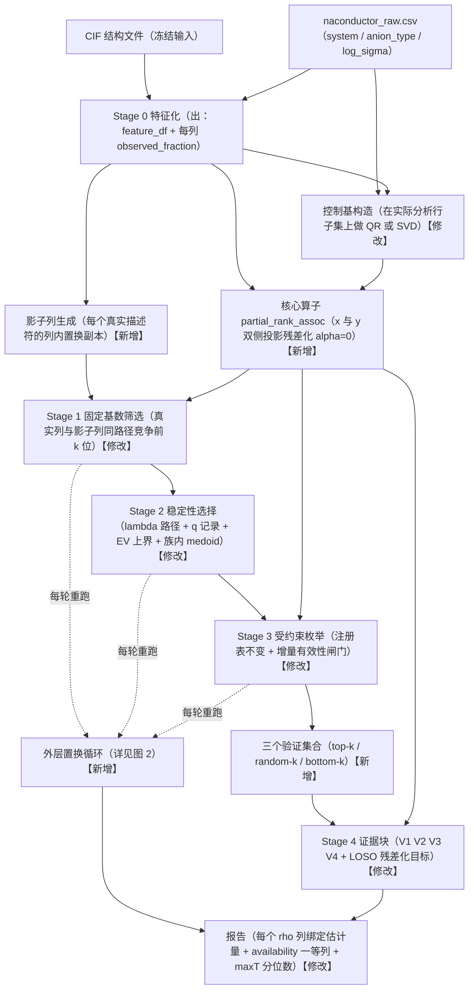
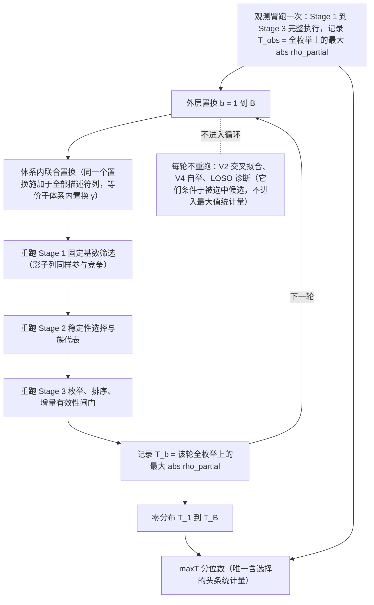
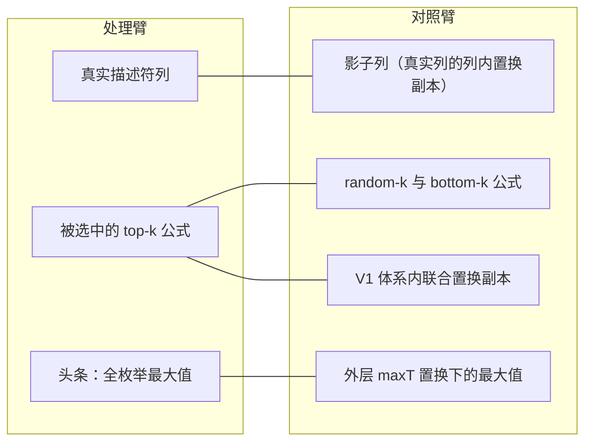

# Research Review

**Date**: 2026-08-07
**Reviewer**: Claude Web (manual bridge)
**Project**: automat-naconductor（Na 离子导体描述符搜索管线）
**Review Type**: research-review (algorithmic design audit, 4-question framework)
**Round**: 1
**Scope**: 算法设计本身（非数值结果），15 个算法步骤逐条四问评估

## Round 1: Initial Review

**评审 rubric**：本次采用的是**你自己给定的四问算法评审框架**（① 是否达成设计目标 ② 退化条件 ③ 最小修复与代价 ④ 对应的标准方法），拒稿视角。这与 run01 的 stat-pipeline A–H、run02 的 ml-eval A–F + G–L 是**三套不同的 rubric**，结论不互相替代：前两轮判的是"这个实现会不会产出可信产物"，本轮判的是"这些过程作为估计量本身是否定义良好"。凡涉及代数性质的推导（如秩统计量的格点、Ridge 收缩因子）都是估计量的结构属性，不是对你数据的评论。

---

## Overall Assessment

**这套管线的核心设计问题不是任何单个步骤的 bug，而是"估计量身份不明"（estimand identity）。** 全流程至少有五个互不相同的量共用 "Spearman" 这个名字并在同一张 CSV 行里并列：(i) 全量原始池化秩相关；(ii) 全量 Ridge 残差化后的秩相关（主指标）；(iii) 折内经仿射模型的原始秩相关（C1/C2 的 composite）；(iv) OOF 池化的"残差目标 vs 未残差化公式"秩相关（V2）；(v) 体系内原始秩相关（V3/V4）。管线中**每一次聚合、每一次比较、每一次"三角验证"都至少跨越其中一条边界**。`composite_score` 与 `deconfounded_spearman` 并列、bootstrap CI 标注在 deconf 行上、LOSO 与 V3 被当作两条独立证据——这些不是措辞疏忽，而是因为 schema 里没有任何字段绑定估计量。一个纯命名纪律（每个 ρ 列名带上其估计量）就能机械暴露管线里大部分自相矛盾，这说明问题层次在设计而不在实现。

**第二个设计层问题：在需要投影的地方用了收缩。** 混杂集是纯分类变量，饱和 OLS 的拟合值就是组均值，投影是唯一无自由参数的正确调整。管线在 A2、D3 三处用 `Ridge(alpha=1.0)`，后果是三重的：(a) 组均值被收缩，残差保留一部分混杂，偏差方向**一致地指向"物理信号更强"**；(b) 收缩因子约为 $n_g/(n_g+\alpha)$，**小组（稀有 anion 类）欠调整最严重**，于是调整强度成了组大小的函数，池化秩相关随即把这个异质偏移读成信号；(c) L2 惩罚施加在参考类编码的对比项上，使结果依赖于参考类别的字母序选择，也使 A1 贪心保留哪几列 anion 从"仅影响元数据"升级为"影响残差"——在 alpha=0 下列空间相同故顺序无关，alpha>0 下顺序即结论。

**第三个设计层问题：所有零分布、基线、对照都与被判定对象来自不同总体。** B1 的高斯噪声列 vs 已过 Stage 1 目标筛的真实描述符；D2 的独立置换分量 vs 实际相互依赖的分量；D6 只验证 top-k 而从不验证一个匹配的非入选对照集。三处的修复原则完全相同——**对照臂必须在除"与 y 的关联"之外的一切维度上与处理臂匹配**——而三处都没做到。另有一个贯穿性的编码习惯放大了上述所有问题：**未执行的计算被编码为有利数值而非缺失**（A2 回退 → proxy=0.0"最纯物理"；NaN → 经 `max(0.0, min(1.0, nan))` 静默变成 1.0；`available: False` 的块仍产出 `validation_status: "exploratory"` 的行）。

---

## Per-Step Algorithmic Assessment

### 步骤 A1: `build_rank_aware_controls`

1. **Does it accomplish its design goal?** 部分达成，且是本文件里方法学意识最好的一处——显式做秩审计、记录冗余列、拒绝把 anion 当独立因果控制，这是真做对的。但它检测的是**精确线性相关**（`np.linalg.matrix_rank` 的 SVD 容差），而真实威胁是**近共线**：一个 99% 由 system 决定的 anion 对比项会被判为"incremental"，随后在 alpha=1.0 下该方向被几乎完全收缩掉——名义上控制了，实际上没调整。秩审计因此提供的是虚假的独立性保证。另有两处自相矛盾：intercept 进了秩计算却不进 `controls`；`control_columns` 列出全部 anion 列而 `residualization_columns` 只列 incremental 列，同一份 metadata 描述两个不同设计。最后，秩在**全样本**上算一次，而 A2 实际用的是 `.loc[valid_mask]` 行子集——子集上某列可能全零，秩下降且从不重算。
2. **Degeneration conditions?** (a) anion 完全嵌套于 system 时，全部对比项冗余，A1 退化为"只控制 system"，`rank_aware` 这个形容词纯装饰；(b) alpha=0 时贪心保留顺序不影响列空间，故只影响元数据标签（无害）；alpha>0 时保留哪几列直接改变收缩靶点，于是**字母序决定结论**；(c) 行子集上设计降秩时，元数据描述的设计与实际残差化的设计不是同一个。
3. **Minimal fix and cost?** 把贪心秩筛选换成**在实际分析行子集上对 $[\mathbf{1}, \text{system}, \text{anion}]$ 做 QR/SVD，按声明的相对容差取数值秩，用投影残差化**。代价：失去"哪个 anion 对比项冗余"的具名可解释性（这是当前 metadata 的卖点），并且必须把容差从隐含选择变成显式声明的参数；计算代价可忽略（每描述符一次 $84\times k$ 的 QR）。
4. **Standard method this is an ad-hoc version of?** **Rank-revealing QR / SVD 数值秩判定**；统计侧对应**秩亏设计下的可估函数（estimable functions）与广义逆**（SAS GLM 的 estimability 检查）；残差化本身是 **Frisch–Waugh–Lovell partialling-out**。近共线诊断的标准工具是**条件数 / VIF**，不是布尔秩。

---

### 步骤 A2: `partial_spearman`

1. **Does it accomplish its design goal?** 不达成。它不是任何标准意义上的 partial Spearman。**运算顺序破坏了选用 Spearman 的全部理由**：标准做法是先秩变换再线性偏出（秩上的偏相关），这里是在原始尺度线性残差化后再取秩。线性残差化不是单调等变的——把 $x$ 换成 $\log x$ 会得到非单调不同的残差，因此这个"Spearman"对 $x$ 的单调变换**不不变**。对纯分类混杂而言，饱和残差化就是**组内减算术均值**，随后把各组残差扔到同一个池里排秩——池化秩的定义依赖于组均值这个参数化、对异常值敏感的量。结果是一个混合物：参数化中心化 + 秩相关，既不是秩方法也不是合格的半参数偏关联。其次，Ridge 收缩使残差保留一部分混杂（偏差方向有利于结论，且小组更严重）。第三，静默回退（`z.shape[1] >= n_samples`）返回原始 Spearman 冒充去混杂值，无任何记录。
2. **Degeneration conditions?** (a) $\alpha \to \infty$：只有未惩罚的截距存活，残差 $\to x - \bar{x}$，**deconf ρ 精确收敛到 raw ρ**，proxy ratio → 0，即"完全未调整"被编码为"最纯物理信号"。这条退化路径是连续的：alpha 是一个从"正确调整"单调滑向"零调整但报告为最高纯度"的旋钮，而没有任何过程设定它。(b) $x$ 在体系内近乎无变异（真·体系代理）：残差是数值噪声，但**秩变换把任意小的残差拉伸成满量程的秩向量**——Spearman 不知道"已经没有东西可相关了"，一个残差方差近零的描述符与一个残差方差很大的描述符输出同尺度的 ρ。(c) $x$ 组内严格常数：残差全 0，`spearmanr` 返回 NaN，经 A3 的 `max(0.0, min(1.0, nan))` 静默变成 1.0 → "体系代理"，即**计算失败被报告为科学结论**。(d) 回退分支触发时 deconf ≡ raw。
3. **Minimal fix and cost?** 四条，按代价升序：① 混杂模型 alpha 设 0（或直接用 pinv 投影）——消除收缩偏差与参考类依赖，代价为零；② 回退分支返回 `deconfound_applied=False` 并把 proxy 置 NaN；③ 同时报告残差方差占比，使"无剩余变异"可见；④ 若要真的秩方法，先秩变换再残差化，或干脆把这个量改名为 `within_system_linear_adjusted_rank_corr`。④ 的代价是估计量改变，此前所有数值不可比，必须全量重跑。
4. **Standard method this is an ad-hoc version of?** 直接对应物是 **partial Spearman's rank correlation via probability-scale residuals（Li & Shepherd 2012；Liu et al. 2018）**——那正是"分类/连续混杂下的秩偏关联"的正规解。此外是 **Frisch–Waugh–Lovell 双侧残差化**；YAML 里点了名却未实现的 **DML（Chernozhukov et al. 2018）partialling-out with cross-fitting**；以及分层秩关联的经典工具 **van Elteren 检验 / CMH 型分层合并**。

---

### 步骤 A3: `system_proxy_ratio`

1. **Does it accomplish its design goal?** 不达成，且是本管线里唯一一个**没有对应总体参数**的量。它被当作方差分解（"相关中有多少比例来自混杂"）呈现，但 Spearman² 不是 R²，raw² 与 deconf² 来自两组不同变量的两个不同秩向量，二者之间不存在任何 $\text{raw}^2 = \text{confounded} + \text{deconfounded}$ 的分解恒等式。它是两个含噪统计量的比值，分母在弱信号区由噪声主导；钳位与硬置不是消除不稳定性而是把它藏起来。更严重的是**方向信息被两个硬编码分支销毁**：符号翻转 → 硬置 1.0，把纯符号噪声与真正的 Simpson 反转（管线最该发现的东西）编码成同一个标签；deconf > raw 的抑制效应 → 负值钳位到 0.0，即"最纯物理信号"。两个相反方向的异常，一个得最低信誉、一个得最高信誉，而它们指示的是同一件事：混杂在结构上很重要。
2. **Degeneration conditions?** (a) raw ρ 接近 0：比值是两个噪声之比，钳位后近似在 [0,1] 上由"哪个噪声更大"决定，标签本质随机（仅被 A4 的 |raw|<0.2 门禁部分掩盖，而那个门禁本身是一次选择）；(b) alpha 过大或 A2 回退：deconf = raw → ratio = 0 → "最纯"；(c) $x$ 与混杂独立（本来就没有混杂问题）：ratio ≈ 0 且正确——**该指标只在混杂本来不成问题时表现如宣称**；(d) NaN → 1.0。
3. **Minimal fix and cost?** 删掉这个标量，改为**联合报告 (raw ρ, deconf ρ) 及其差的区间**。若必须要单一标量，用 **Fisher-z 差** $z(\rho_{\text{deconf}}) - z(\rho_{\text{raw}})$：加性尺度、保号、无界（不需要钳位）、方差已知。代价：不再有界于 [0,1]，A4 的四分类标签体系必须重写；每描述符一个重抽样循环（可忽略）。**更省事的做法是直接删除并把这个角色交给 D2/V1**——V1 的体系内置换零分布正是 A3 想表达的东西的正确操作化版本。
4. **Standard method this is an ad-hoc version of?** 流行病学的 **change-in-estimate（Δβ%）混杂判定法**（10% 规则），该规则本身在文献中已被批评；以及中介分析的 **proportion mediated**——后者的已知失效模式与这里逐条对应：总效应接近零时不稳定、inconsistent mediation（抑制）下无定义。正规的嵌套模型类比是**偏决定系数** $R^2_{\text{partial}} = (R^2_{\text{full}} - R^2_{\text{red}})/(1 - R^2_{\text{red}})$，它要求真的跑两个嵌套回归，而不是取两个相关系数的平方之比。

---

### 步骤 A4: `_classify_descriptor`

1. **Does it accomplish its design goal?** 不达成。它是点估计的确定性函数，不接收任何不确定性输入，且分支顺序使代理比在 |deconf|>0.3 时完全不起约束作用。这个矛盾是**结构性的而非边角情形**：proxy ≥ 0.7 ⟺ |deconf| ≤ √0.3·|raw| ≈ 0.548|raw|，故只要 0.3 < |deconf| < 0.548 且 |raw| ≥ |deconf|/0.548 ≤ 1，"强物理信号"与"体系代理"的判据区域就非空重叠。`deconf_p` 是死参数，docstring 里的"显著"没有实现；即便接进来，A2 残差上的 p 值也不扣除已估计的混杂参数，是反保守的。最后，`|raw|<0.2 → 噪声级` 置于最前，使标签空间中**根本不存在"被混杂压制的信号"这一类**——去混杂最该负责发现的一类现象在分类器里不可达。
2. **Degeneration conditions?** (a) 若多数描述符 |deconf|>0.3，分类器输出常数，信息量为零，退化为 Stage 1 的直通；(b) 若 proxy 因 alpha 或回退恒为 0，分类器退化为对 |raw| 与 |deconf| 的两阈值分箱，即"按相关强度排序"——正是本模块存在的理由所要取代的那个过程；(c) 残差恒定 → NaN → proxy 1.0 → "体系代理"，计算失败被读成发现。
3. **Minimal fix and cost?** 让标签成为**区间的函数而非点的函数**：仅当 deconf ρ 的置换/自举区间排除声明的零带时才发标签；把代理比条件从"被优先级覆盖"改为"合取"（strong ⟺ 区间排除 0 **且** proxy < τ）；另开一个 `suppression` 标签接住符号翻转与 |deconf|>|raw|。代价是诚实的：在这个样本规模下大部分描述符会落入"未定"，**Stage 2/3 的候选池会明显缩水**，管线的表观产出下降。
4. **Standard method this is an ad-hoc version of?** **带多重性控制的假设检验决策规则**（对偏关联检验做 BH-FDR）；标签体系本身是**对 (效应量 × 混杂偏差) 平面的粗暴离散化**，正规版本是**在 raw–adjusted 平面上画联合置信域**，或改用 **E-value / 敏感性分析框架（VanderWeele & Ding）**——报告"需要多强的未测混杂才能解释掉这个关联"，而不是发一个分类判词。

---

### 步骤 B1: `StabilitySelector.run`

1. **Does it accomplish its design goal?** 机械部分实现了，但缺三样使它成为 stability selection 的东西。**(a) 无正则化路径。** MB 的 stability selection 定义在 λ 路径上（$\Pi = \max_\lambda$ 选中频率），或用 randomised Lasso 逐子样本扰动惩罚。这里是单一固定 alpha，于是选中频率退化为 |边际相关| 的一个软阈值化平滑函数。**(b) 无误差控制。** MB 的 $E[V] \le q^2/((2\pi_{\text{thr}}-1)p)$ 需要记录每次子样本的选中数 $q$；代码不记录 $q$，因此该界**事后也无法计算**，而 threshold=0.6 取的是常用区间的最宽松端。**(c) 噪声基线与真实列不可交换**：噪声列是无缺失、无互相关、无重尾的 i.i.d. 高斯，且未过 Stage 1 目标筛；用 95 分位数当门槛意味着**按构造允许约 1/20 的零列通过**，且该分位数由若干条互相关（共享子样本）的频率估计，估计误差本身不小。做对的地方要记：**无放回抽样 n/2、每子样本内独立拟合预处理**，这两点是正确的。另有一条未被前两轮审计点到的隐患：**中位数填充 + 折内标准化会把一个高缺失列变成"近常数再被重新缩放"的列**，其取值近似编码"谁被观测到"，而观测与否与数据来源相关、来源与 system 相关——这是一条未被任何环节阻断的类泄露通路。
2. **Degeneration conditions?** (a) alpha 过大：全部系数为零 → 全部频率 0 → 基线 0 → `freq > 0.0` 为 False → 合格集为空；(b) alpha 过小：全部频率 1 → 噪声 95 分位数 = 1.0 → `freq > 1.0` 为 False → 合格集同样为空。**`is_stable ∧ above_noise_baseline` 只在一个居中的 alpha 窗口内可同时满足，而没有任何过程去设定这个窗口**；(c) 描述符高度相关时，Lasso 每次子样本任选簇内一个，频率被摊薄到整簇之下阈值——**最可复现的物理（一个冗余族）最容易被判为不稳定**；(d) `X_noise is None` 时基线恒 0，该列变成永真的装饰。
3. **Minimal fix and cost?** ① 用**每列自身的置换影子列**替换高斯噪声列（保留边际分布、缺失模式与重尾），并让影子列走**完全相同的 Stage 1 路径**——这是唯一能让对照臂匹配的改法；② 记录每子样本 $q$ 并输出 MB / Shah–Samworth 的 $E[V]$ 上界；③ 在 λ 路径上取 max 频率。代价：① 需要把 Stage 1 预筛重构为可对注入列调用的纯函数（**这是本条里唯一真正的工程成本**）；②③ 计算代价是 $B \times |\Lambda|$ 次拟合，在这个规模下可忽略。
4. **Standard method this is an ad-hoc version of?** **Meinshausen–Bühlmann stability selection (2010)** 与 **Shah–Samworth complementary pairs (2013)**；噪声列装置是 **Boruta 的 shadow features** 的劣化版（Boruta 用真实列的置换副本，正好修掉这里的分布不匹配），其有理论保证的现代对应物是 **model-X knockoffs（Barber & Candès）**，那正是"构造与真实特征联合分布匹配的伪特征并获得 FDR 控制"的正规解。相关簇的处理对应 **group Lasso / cluster elastic net**。

---

### 步骤 B2: `PhysicalGrouper.group_and_select`

1. **Does it accomplish its design goal?** 达成的是**多样化**，不是**代表性**，二者被混为一谈。两个独立的设计缺陷：**(a) 选代表的判据就是下游排序与报告用的同一个统计量。** 代表的 ρ 是一个次序统计量，即使在零假设下其期望也高于族内典型值，**且随族成员数单调增大**——于是"物理族"之间的比较被族大小系统性混杂，成员多的族天然拥有看起来更强的代表。**(b) 分组依据是人工声明的族而非经验冗余**：跨族的近重复描述符会双双存活，随后在 D1 里被组合成"跨族组合"，而其实是同一个量的算术变换；反之，成员真正正交的族被强制丢掉 $k-1$ 个自由度。另有一条讽刺之处：整个 Stage 2 为"描述符是否被选中"做了稳定性分析，却对**"谁是代表"这一最后一次选择完全没有稳定性度量**。
2. **Degeneration conditions?** (a) 所有描述符同族 + `max_per_family=1` → `rep_names` 只有一个元素 → D1 的 `combinations(rep_names, 2)` 为空 → **整个组合阶段静默产出空表**；(b) 族内 ρ 在统计上不可区分时，argmax 是抛硬币，代表身份随行子集/种子跳变而无任何记录；(c) 若每族恰好一个成员，B2 退化为恒等过滤器；(d) `how="left"` 合并 + `.get(default)` 使 deconfound_df 里缺失的描述符静默拿到 NaN ρ，`nlargest` 丢弃 NaN，整族可能无声地不产生代表。
3. **Minimal fix and cost?** 把代表判据换成**与 y 无关**的量。最便宜且保留可解释性的版本是**族内 medoid**（与同族成员平均相关最高者），完全不接触 y，计算代价为零。更强的是族内第一主成分，但那会把 D1 组合的对象从具名物理量变成复合量，与项目"物理可解释"的目标直接冲突，因此不推荐。真实代价在别处：改成 y-无关判据后，被选中的代表与 y 的关联通常更弱，**管线头条数字会下降**——这正是当前设计在借由次序统计量虚增的部分。
4. **Standard method this is an ad-hoc version of?** **变量聚类的代表选择（VARCLUS、ClustOfVar、层次聚类 + medoid）**；"每组取最大 |ρ|"这条规则本身是 **selection by maximum / winner's curse** 的教科书情形，标准补救是**选择后条件似然修正、Efron 的选择偏差校正、经验贝叶斯收缩**。

---

### 步骤 C1: `MultiStrategyCV` 三策略

1. **Does it accomplish its design goal?** 不达成，而且退化的严重程度超出 run02 的表述。当 X 只有一列（单描述符基线与组合验证都是 `reshape(-1,1)`），Ridge 的预测在验证折上是 $x$ 的仿射函数，故 $\text{Spearman}(y_{\text{val}}, \hat y) = \text{sign}(a)\cdot\text{Spearman}(y_{\text{val}}, x_{\text{val}})$——**alpha、StandardScaler、正则化对报告的指标完全无效**。唯一残留的模型效应是 `SimpleImputer` 把验证折的缺失值映射到训练折中位数这一个常数上，从而制造一个并列秩块。因此三条"CV 策略"不是三种模型验证，而是**同一个估计量（子集内原始秩相关）在三种抽样方案下的平均，且无一条做了去混杂**。逐条再看：**LOSO** 在单列仿射模型下的折指标 = $\text{sign}(a_{\text{train}})\cdot\rho_{\text{within}}(\text{留出体系})$，而 D4/V3 直接报 $\rho_{\text{within}}$——**LOSO 相对 V3 的全部增量信息是每折一个符号位**，"LOSO 与 V3 一致"不是佐证。**阴离子分层 K 折**的方向是反的：分层保证每个验证折都是各阴离子类型的混合，即**每折都是被混杂的整体的缩影**；若目的是检验对混杂的稳健性，需要的是分组（留一阴离子）而非分层——分层是分类任务里保类别平衡的工具，被误用在了混杂控制的位置上。**重复子采样**的测试集互相重叠，其重复间方差被系统性低估（Nadeau–Bengio），而代码只报均值、不报离散度。
2. **Degeneration conditions?** (a) 单列 X（默认路径）→ 全部退化为折内原始秩相关；(b) 折内 ρ 非有限时被 `_mean_or_nan` 静默丢弃，实际贡献折数随描述符变化而无记录；(c) 阴离子类别支持不足 → 折数下调（**这一点有记录，是做对的**）或整策略跳过，此时 composite 落在不同策略子集上，跨描述符不可比；(d) 折很小时 ρ 只能取一个粗糙格点上的值，折平均是格点均值。
3. **Minimal fix and cost?** ① 既然模型在单列下是惰性的，要么删掉模型层并把这个量正名为"折内秩关联"，要么评估一个真能与仿射映射不同的模型；② 若目的是混杂稳健性，把阴离子分层换成**阴离子分组**；③ 让 CV 在**折内残差化后的 y** 上计算（V2 已经会这么做），使 CV 与主指标估计同一个东西；④ 报告折间离散度而非只报均值。代价：② 会减少有效折数、可能使该策略不可用；③ 使 CV 数字与历史不可比且普遍下降；①④ 免费。
4. **Standard method this is an ad-hoc version of?** **分组/分块交叉验证（GroupKFold、leave-one-cluster-out）**，即结构化数据下检验跨组泛化的正规工具（Roberts et al. 2017 的 blocking 讨论）；分层 K 折是**为分类类别平衡设计的 stratified CV** 的误用；方差侧对应 **Nadeau & Bengio 修正重抽样 t 检验** 与 **Dietterich 5×2 cv**；相关系数的折间平均应走 **Fisher z 变换**。

---

### 步骤 C2: `summarize_cv_spearman`

1. **Does it accomplish its design goal?** 不达成，且失败方式是自伤的。**取绝对值销毁方向**：两条策略符号相反与两条同号得到同一个 composite。而跨分组的符号反转正是 Simpson 悖论的定义，也正是去混杂层存在的理由——**聚合把管线里最具诊断价值的信息删掉了**。更糟的是两层聚合用了两套相反的符号约定：策略内是**带符号**折平均（折间反转互相抵消 → 趋近 0，看起来"无信号"），策略间是**取绝对值**（策略间反转被掩盖 → 看起来"有信号"）。其次，均值取在**可变大小的策略集**上，2 条与 3 条策略算出的 composite 不同尺度、不同偏差；代码记录了 `composite_strategy_count` 与 `composite_is_complete`（**这是做对的**），但排序时无人消费。第三，三条策略高度依赖（同 84 行、折重叠、LOSO ≈ V3），三者均值的标准误接近单条策略，却**呈现为三方独立三角验证**。
2. **Degeneration conditions?** (a) 零假设下 $E|\rho| > 0$ 且随折变小而增大，故**按 composite 排序会系统性偏好在最嘈杂划分下被评估的候选**；(b) 只有一条策略可用时，"composite"是那条策略的改名；(c) 全部不可用 → NaN（这一点处理正确）。
3. **Minimal fix and cost?** 用**带符号的 Fisher-z 加权合并**（权重按折内 n），把"策略间离散度"作为独立列报出，并**强制 `composite_is_complete` 为跨候选比较的前置条件**；|ρ| 只作为一个显式命名的幅度列保留，不参与排序。计算代价为零；实际代价是 composite 数值下降、相当一部分候选变为"不可比"。
4. **Standard method this is an ad-hoc version of?** **Fisher-z 变换下的元分析式合并**（存在研究内相关时应用随机效应或多层模型处理依赖）；取绝对值这一步没有合法对应物——最接近的正当形式是**双边检验统计量**，即用 |z| 对其零分布比较，而不是把 |ρ| 当分数去平均。

---

### 步骤 D1: `ConstrainedCombinationSearch.search`

1. **Does it accomplish its design goal?** 约束机制本身是全项目工程质量最高的部分：声明式注册表、交换算符的规范无序对、比值方向显式登记、分母掩码、provenance 全程记录——作为**受约束的符号枚举**它确实做到了它声称的事。失败在构造之外的四处。**(a) 排序判据就是将被报告的统计量，且无搜索空间规模的校正。** 输出是 |deconf ρ| 在候选集上的最大值；相关统计量最大值的零期望约以 $\sqrt{2\log m_{\text{eff}}}$ 增长，而 $m_{\text{eff}}$ 是**数据依赖的**（取决于 B1/B2 存活了几个代表、几个族），从未被记录——管线连自己检验了多少假设都不知道。`max_candidates=150` 是排序后截断，本身是又一次选择，不是校正。**(b) 支持集不匹配的候选被放在同一尺度上比较。** ratio 的 `d2 != 0` 掩码使 n_valid 随公式变化，而 |ρ| 的零方差是支持集大小的减函数——**枚举因此系统性偏好支持集最小的公式**，唯一的闸门是 `n_valid < 5`。**(c) 量纲检查名不副实。** `_operator_dimensionally_valid` 只管 `+`；`_formula_dimensionally_valid` 走完循环后**无条件 `return True`**，唯一的 False 出口是中途的 `+` 不匹配；且 multiply/ratio 分支构造的量纲字符串（`(A)*(B)`、`(A)/(B)`）永远不会与后续 `+` 操作数的朴素量纲字符串相等，于是该检查在它最该起作用的地方（三元式）要么误拒要么形同虚设。**(d) `+` 与 `multiply` 在秩空间里的行为与声明的禁令冲突**：原始物理值不标准化直接相加，量级大的分量支配，$\rho(a+b) \approx \rho(a)$——**枚举会大量产出与其支配分量在统计上不可区分的"组合"，而没有任何环节检测这一点**；且对严格正的量，`multiply` 与 `ratio` 分别秩等价于 $\log a + \log b$ 与 $\log a - \log b$，所以 `forbidden_operators` 里禁 log 的理由在秩空间中是自我消解的。
2. **Degeneration conditions?** (a) 分量量级悬殊时，`+` 组合退化为其支配分量；(b) 分母近零穿越时，ratio 的秩对微小扰动剧烈重排——Spearman 只压制了幅度的重尾，没压制**秩本身的不稳定**；(c) **在 `max_per_family=1` 的默认下，`by_family` 每族仅一个成员，`combinations(family_names, 2)` 恒空，三元枚举分支结构上不可达**（run_pipeline.py 未提供；据 run01 描述三描述符模式下代表名额放宽到 2，若如此则该分支可达，但代价是 B2 的次序统计量虚增翻倍）；(d) 代表集为空或仅一个 → 返回空表，静默。
3. **Minimal fix and cost?** ① **要求每个候选在同一支持集上超过其自身分量**（增量关联检验），不达标者不得进入排序——免费，且直接消灭 (d) 类退化；② 记录实现的枚举规模与每候选 n_valid，并把支持集大小纳入比较；③ 修 `_formula_dimensionally_valid` 使其真正返回判定并规范化量纲字符串，或删除它并声明量纲检查仅适用于已知量纲的 `+`——两条都免费。真正昂贵的是 ④：把零分布提到**整个枚举**层面（见 Top 3 第 1 条）。
4. **Standard method this is an ad-hoc version of?** 注册表本质是一部产生式文法，对应**语法约束的符号回归 / grammar-guided genetic programming**（也是 YAML 里排除掉的 SISSO 的同一族方法）；按最大值选模型而不做选择性推断校正，对应的正规工具是 **Westfall–Young maxT 步降置换法**（正好处理候选间任意依赖）与 **selective inference / PoSI（Berk et al.）**；"组合是否优于其分量"是 **嵌套模型比较 / incremental validity（commonality analysis）**。

---

### 步骤 D2: `_noise_baseline`（V1）

1. **Does it accomplish its design goal?** **这是全代码库构思最正确的一块，值得单独记功。** 体系内置换保留每个分量的组内边际分布与整体的组间结构，只打断与 y 的配对；于是零分布**保留了 system 能单独产生的那部分关联**，观测值与之比较等价于检验"超出体系结构之外的组内关联"。这正是 `system_proxy_ratio` 想表达而没做对的事——**A3 可以删除，把它的角色整体交给 V1**。但有三处缺陷。**(a) 零分布与主指标不是同一个量**：`observed` 是原始池化 Spearman，排序与报告用的是 `combined_deconf_spearman`，V1 给出的分位数属于一个不被展示的统计量。**(b) 各分量被独立置换，破坏了分量间的联合依赖**：对 multiply/ratio 而言，公式的方差与尾部强烈依赖分量相关性，因此零公式的边际分布与观测公式不同，可交换性论证不成立。**(c) 选择不在零分布内**：置换施加在一个**已经作为枚举最大值被选出**的公式上，故该分位数是"预先指定公式"的 p 值，不是"被选中公式"的 p 值。此外 `observed_percentile` 用 `mean(noise <= observed)` 是左尾比例而非 p 值（缺 $(1+\#\{\ge\})/(B+1)$ 的 +1 修正），且 `available` 只看 observed 是否有限，不看 `n_success` 有多少。
2. **Degeneration conditions?** 体系组规模缩小时，组内置换的有效随机性下降；**极限情形下所有组为单例，每次抽样都是恒等置换，零分布塌缩到观测值，检验功效为零**（方向上是保守的：保留的真实配对把零分布推向观测值，p 值虚高）。ratio 公式还会因置换后分母为零而丢弃抽样，使零分布条件在一个与观测不同的支持集上。
3. **Minimal fix and cost?** **一行修复解决 (b)：对所有分量使用同一个体系内置换**（`perm = rng.permutation(idx)` 复用），这与"体系内置换 y"完全等价，保留分量联合分布而只切断与 y 的链接。**(a) 的修复：在每次抽样上重算去混杂 ρ 而非原始 ρ**，代价是每抽样多一次 Ridge/投影拟合（可忽略）。**(c) 只能靠把选择本身放进置换循环**（Top 3 第 1 条）。抽样数与 p 值定义的修正是免费的。
4. **Standard method this is an ad-hoc version of?** **分层（区组内）置换检验 / conditional randomization test**；对"偏关联"这一具体目标，标准方案是 **Freedman–Lane 置换方案**（在缩减模型残差上置换），这正是这块应该长成的样子；选择校正对应 **Westfall–Young maxT**；model-X 侧对应 **CRT（Candès et al.）**。

---

### 步骤 D3: `_factor_spanning`（V2）

1. **Does it accomplish its design goal?** 方法学野心最高、也最接近正确的一块：控制模型仅在训练折拟合、折内填充与标准化、回退有记录、每折元数据落盘、显式否认因果——这些都对。但有一个**决定性的不对称**似乎未被前两轮审计点到：**它残差化了 y，却没有残差化 x**。`formula_model.fit(train_values, train_residual)` 里的 x 是原始公式值。于是 V2 不是 Neyman 正交的得分函数——公式自身对混杂的依赖完整保留在预测子里。后果可以精确写出：目标残差在饱和调整下应无组间成分，但 Ridge 收缩使其**保留一部分组间变异**，而这部分与 x 的组间铺展直接相关，故**偏差项的大小正比于该描述符作为体系代理的程度**——欠调整的收益恰好流向管线本应惩罚的那一类描述符。第二个问题：**跨折池化 OOF 残差**。第 k 折的残差是 $y - f_k(z)$，第 j 折的是 $y - f_j(z)$，池化向量不是任何单一模型下的残差；小折 + 收缩组均值时，折间拟合组均值的差异可与组内信号同量级，于是**池化秩相关中有一个纯粹由"样本落在哪一折"驱动的成分**。第三，单列 x 使这里的 Ridge 同样只贡献一个符号（外加缺失值被填成训练中位数所产生的并列块——缺失若与 system 非随机相关，这个并列块本身有系统性方向）。
2. **Degeneration conditions?** (a) `encode_controls` 对训练折未见的类别整行编 0，即**静默当作参考类**；由于分层在 system 上，system 列安全，**暴露面是稀有 anion 类**——这些样本的残差变成 $y - $ 参考类均值，是一个大的系统性偏移，随后在秩相关里落到两端、取得最大杠杆。`anion_incremental_rank` 每折有记录（做对了）但不设闸；(b) 折内符号翻转时，池化前的定向不一致，池化 ρ 是混合物；(c) `n_splits = min(5, 最小体系计数)`，一个小体系压低所有人的折数；(d) 缺失公式值经填充变成同一常数，形成大并列块，把 ρ 拉向 0——但方向依缺失机制而定。
3. **Minimal fix and cost?** ① **折内计算统计量、用 Fisher z 聚合**，而不是先池化再算一次；② 对 x 也做折外残差化，使之成为真正的正交得分（这才是 DML）；③ 未见类别的测试行显式剔除并记录计数，或直接抛错。代价：①② 使每个统计量的有效样本更少、区间更宽，**结论会看起来更弱**——这正是修复的意义；③ 可能掏空某些折。
4. **Standard method this is an ad-hoc version of?** **Double/Debiased Machine Learning with cross-fitting（Chernozhukov et al. 2018）的单侧不完整版**——正交得分要求 x 与 y 双侧折外残差化后再取关联；以及**部分线性模型的 cross-fitted partialling-out**。池化 vs 逐折聚合的取舍是 CV 文献里已有定论的 **pooled-OOF vs averaged-per-fold** 问题。

---

### 步骤 D4: `_per_system`（V3）

1. **Does it accomplish its design goal?** 作为描述性拆分达成，且**它在方法学上比主指标更可辩护**：按体系分层是无函数形式假设、无收缩参数的调整方式，而 A2 是有的。讽刺之处在于，这个更干净的估计被归为第三顺位的"exploratory"证据，而更脆弱的 A2 是主指标。缺陷有三：**(a) 只报三个点估计，无合并量、无权重、无异质性统计量**——而"这是普适机制还是体系特异"正是项目的科学问题本身，一次 Fisher-z 合并 + Q/I² 就能直接回答；**(b) 各组 n 悬殊、无区间**，读者在比较精度差异极大的三个数；**(c) 分层变量是真实混杂（温度、测量方法、bulk/total）的代理而非真实混杂本身**，故层内残余混杂无界——这是数据模式问题，但在算法层的后果是：V3 的"体系内"三个字承诺了一个它无法交付的条件独立性。
2. **Degeneration conditions?** 这是本步骤最尖锐的一条，且是纯组合学结论：**$n=3$ 的组，Spearman 只能取 $\{\pm 1, \pm 0.5\}$，故 $|\rho| \ge 0.5$ 恒成立，零假设下 $E|\rho| = 2/3$。一个三样本体系在结构上无法报出弱证据。** $n=4$ 才首次可能取到 0。因此小体系的 per-system 行**必然看起来强**，且这个"强"完全由格点结构而非数据产生。此外：组内 x 或 y 常数 → NaN → 该组被丢弃；`available` 只要**任一**组有限即为 True，允许单组独撑整块证据。
3. **Minimal fix and cost?** ① 设最小 n 闸门（低于闸门标 `insufficient`，不出 ρ）；② 小 n 直接给**精确置换 p 值**（枚举可行）；③ 加 Fisher-z 合并 + Cochran's Q / I² 异质性统计量。全部计算代价可忽略；实际代价是小体系会被明确标为无信息，证据基数缩小。
4. **Standard method this is an ad-hoc version of?** **分层分析 / Cochran–Mantel–Haenszel 型合并**；秩数据的对应物是 **van Elteren 分层 Wilcoxon**；合并与异质性用 **Fisher-z 固定/随机效应元分析 + Q/I²**；"关联在各层是否一致"本质是**效应修饰 / 交互作用检验**。

---

### 步骤 D5: `_bootstrap_ci`（V4）

1. **Does it accomplish its design goal?** 部分达成。做对的一点要记：**按体系分层重抽样固定了各组规模**，这与"体系构成是设计固定"的视角一致，也避免了某体系整体消失的退化抽样。但三处硬伤：**(a) 它自举的是原始池化 Spearman，不是去混杂 Spearman**（`estimate = _safe_spearman(values_valid, y_valid)`），而这个区间被扁平化进与 `combined_deconf_spearman` 相距两列的同一行，并被标为该行**唯一的** `uncertainty_method`——这是整份产物里最容易被误读的一处；**(b) percentile 法**用于一个有界、偏斜的统计量：Spearman 的自举分布在小 n 下明显偏斜，percentile 区间只有一阶精度且已知对相关系数欠覆盖；**(c) 不含选择**：区间是"条件于已被选中"的，对被选候选的真值系统性欠覆盖（winner's curse），也不含 Stage 1 预筛、族代表选择、top-k 截断中的任何一次。另有一条秩统计量特有的细节：有放回重抽样制造并列，Spearman 转用平均秩版本，故自举分布并非无并列统计量的抽样分布。
2. **Degeneration conditions?** (a) 某体系规模占绝对多数时，区间宽度主要反映该体系的抽样误差；(b) 某体系 n=1 时 `rng.choice(idx, size=1, replace=True)` 恒返回同一行，该行在所有抽样中固定，**区间被人为收窄**；(c) 组内 x 或 y 近常数时大量抽样退化被丢弃，区间条件在"非退化"事件上；(d) 2.5%/97.5% 端点由约第 12/13 个次序统计量决定，端点的蒙特卡洛误差不可忽略。
3. **Minimal fix and cost?** ① **自举主指标**（每次抽样内重建控制设计并重算去混杂 ρ）；② 改 **BCa** 或 Fisher-z 变换后回代；③ 列名写清区间属于哪个统计量。代价：① 每抽样多一次投影拟合（此规模下可忽略）；② BCa 需要额外的 jackknife（n 次，可忽略）；③ 破坏下游读表脚本的 schema。含选择的覆盖只能靠把整条选择链放进重抽样（Top 3 第 1 条）。
4. **Standard method this is an ad-hoc version of?** **分层/区组非参数自举**；升级版是 **BCa（Efron）** 或 Fisher-z 区间。关于选择：**模型选择之后的自举已知失效**，正规工具是**选择性推断**或**把整个过程（含选择）纳入重抽样**。

---

### 步骤 D6: `CombinationValidator.validate`

1. **Does it accomplish its design goal?** 作为**序列化工程**它做得异常扎实——严格 JSON、结构化公式字段与 legacy pair 字段的一致性校验、拒绝把部分损坏的公式数据静默降级为 legacy 路径。这是全项目 provenance 纪律最强的一处。算法上的问题全部发生在**扁平化时的证据语义损失**：**(a) `full_validation` 算出的 `uncertainty.selection_uncertainty_included: False` 没有进入 record**，记录里只留下 `uncertainty_method`。全项目唯一一处对乐观偏差的承认，恰好是扁平化丢弃的那一个——**损失方向是单向的：去掉限定词、留下结论**。**(b) 四个证据强度迥异的块被并置为等价物**：V1 是原始 ρ 的置换零分布、V2 是残差化目标上的折外关联、V3 是分层原始 ρ、V4 是原始 ρ 的自举区间，而排序列 `combined_deconf_spearman` 是**第五个**统计量。一行里五个估计量，全都叫 spearman，**schema 隐含了计算并不具备的可通约性**。**(c) `validation_status: "exploratory"` 是硬编码字面量**，不读任何 availability 标志：所有块 `available: False` 的行照样标 exploratory，且没有聚合可用性列——失败信息只存在于报表模板与电子表格不会解析的 JSON blob 里。**(d) 只验证 top-k**，读者没有任何"非入选候选的 V1–V4 长什么样"的参照分布。**(e) `except KeyError: continue` 静默丢弃候选而不记数**，top-k 可能实际不足 k 且无痕；同时 `ValueError` 不被捕获，错误处理不对称。
2. **Degeneration conditions?** (a) 全块不可用时输出一行看起来完整的"exploratory"记录；(b) 大量候选被 KeyError 丢弃时，"top-10"实为"存活的前若干"；(c) 嵌套 `evidence_blocks` 与扁平列重复存储同一批对象，下游可从任一侧读取，选错侧不会报错。
3. **Minimal fix and cost?** ① 把每个块的 `available` / `reason` / `selection_uncertainty_included` 提升为一等列；② `validation_status` 由块可用性派生而非硬编码；③ **每个 ρ 列名带上估计量后缀**（如 `bootstrap_ci_of_raw_spearman`）——这一条单独就能机械暴露上面 (b) 的全部矛盾；④ **对 random-k 与 bottom-k 候选同样跑 V1–V4**，作为内部对照。代价：①③ 破坏 schema、需要同步改报表模板；④ 把验证成本乘以 2–3 倍（在此规模下可忽略），但它是**性价比最高的一条**——它提供的是当前完全缺失的参照系。
4. **Standard method this is an ad-hoc version of?** 这是一套自制的**证据/溯源模型**；正规参照是 **ICH E9(R1) 的 estimand 框架**（每个数值绑定一个明确定义的估计量），以及产物层的 **tidy 统计输出约定（每行携带 term / statistic / method）**。

---

### 步骤 E1: Stage1→Stage2→Stage3→Stage4 全量目标依赖选择链

1. **Does it accomplish its design goal?** 不达成，且它吸收了上面大部分问题。精确表述：Stage 1 按 $(x,y)$ 的函数过滤；Stage 2 按 $(X,y)$ 的函数（Lasso 频率）与 $|\rho_{\text{deconf}}|$（代表选择）两次筛选；Stage 3 按 $(\text{formula}, y)$ 排序；Stage 4 在**同一批行**上用 $(\text{formula}, y)$ 的函数评估。复合之后，最终报告的统计量是"**在一条由数据本身决定的搜索路径上取的最大值，并在定义该路径的同一批数据上求值**"，其零分布不是该统计量的零分布，而是"自适应选出的集合上最大值"的零分布——没有任何阶段计算过它。附带两条结构性耦合：Stage 1 的预筛改变了 Stage 2 的 Lasso 看到的相关结构（从而改变相关簇里谁被选中）；Stage 2 的 `max_per_family` 决定 Stage 3 的三元分支是否可达。**因此有效检验假设数是上游决策的函数，管线自己也不知道它是多少**，而这个数从不落盘。此外三个阶段对同一个 y 的 NaN 掩码契约不一致（Stage 1 逐描述符掩、Stage 2 不掩、Stage 4 掩），意味着各阶段的统计量算在不同的行总体上然后被互相比较。
2. **Degeneration conditions?** (a) 任一上游阶段过严 → 下游空表，静默；(b) 上游过松 → 枚举规模膨胀而多重性负担不被记录；(c) 由于所有候选共享同一个固定折划分（`random_state=42` 字面量），**跨候选的评估误差是相关的**，最大值因此在划分特定的方向上被虚增，且这一点不会被"多个候选都一致"所暴露——恰恰相反，共享划分会制造一致性的假象。
3. **Minimal fix and cost?** 最小改动是**在最外层加一个按 system（或 anion）留出的外层分组划分，内层完整重跑 Stage 1–4**。计算代价很小（整条管线是 $O(84)$），真正的代价是**工程重构**：Stage 1 预筛、噪声注入、族分组、枚举必须全部改写成"行索引集的纯函数"。但必须把一个后果讲清楚：**嵌套 CV 验证的是"这个流程"的泛化能力，不是"某个描述符"的真实性**——每个外层折可能选出不同的描述符，其输出是一个过程级估计，而项目要的交付物是一个具名描述符。**能为某个具名选择背书的工具只有选择性推断或一个留出的确认集**，而 `program.md` 的"不预拆分"契约已经把后者排除掉了。这是一个设计层的取舍，不是可以靠加代码绕过的。
4. **Standard method this is an ad-hoc version of?** **嵌套交叉验证**（外层评估、内层承担一切数据依赖决策）；**Westfall–Young maxT 置换**覆盖整条管线；**selective inference / PoSI**；以及最朴素但最有效的**样本分割 / 确认集**。报告侧对应**分析路径的预注册**。

---

## Cross-Cutting Issues

**1. 估计量身份（贯穿 A2/A3/C2/D2/D5/D6）。** 五个不同的量共用 "spearman" 一名并被并列、相减、平均、配区间。单一的命名纪律（列名绑定估计量）是本报告里投入产出比最高的改动，因为它把语义错误转化为**机械可检的 schema 错误**。

**2. 在需要投影的地方用收缩（A1/A2/D3）。** 分类混杂下 alpha>0 的三个后果——欠调整偏向结论、欠调整程度随组变小而加剧、结果依赖参考类与列保留顺序——是同一个根因的三种表现。`alpha=0` 一处改动同时关掉三个。

**3. 单列 X 使模型层全程惰性（C1/C2/D3）。** Ridge、StandardScaler、alpha 对任何基于秩的折指标都没有影响，唯一残留效应是中位数填充制造的并列块。管线因此包含一个对报告数值零贡献的"建模层"，而 alpha 出现在五个配置块里，暗示了一个并不存在的调参面。

**4. 对照臂与处理臂来自不同总体（B1/D2/D6）。** 高斯噪声列 vs 已过筛的真实列；独立置换的分量 vs 实际相依的分量；只有 top-k 而无匹配的非入选对照。三处的修复原则同一条：**除"与 y 的链接"外，对照必须在一切维度上匹配**。

**5. 未执行的计算被编码为有利数值而非缺失（A2/A3/A4/B1/D6）。** 回退 → proxy 0.0；NaN → 经 `max(0.0, min(1.0, nan))` → 1.0；高缺失列 → 填充后近常数再被重新缩放；全块不可用 → 仍标 exploratory。管线违反的通则只有一句：**没做的计算必须是 NaN，不能是数**。

**6. 符号约定在每一层都不同（A3/B2/C1/C2/D1）。** 折内带符号、策略间取绝对值、符号翻转硬置常数、按 |·| 排序但输出保号。而项目的科学问题是方向性的（单调构效关系），去混杂问题的核心特征是符号反转（Simpson）——符号是承重结构，却处处不一致。

**7. 秩变换被施加在非保秩运算之后（A2/B1/C1/D1/D3）。** 残差化、算术组合、缺失填充都不保秩，因此"Spearman 非参数稳健适合小样本"这条理由不传递到实际计算的统计量上。附带一条：秩相关**丢弃残差变异的量级**，故"调整后已无剩余变异"与"剩余变异中有强关系"在输出中不可区分。

**8. 缺失性是一个未被承认的协变量（A2/B1/D1）。** 行支持集随描述符（Stage 1 掩码）与公式（ratio 分母）变化，而 |ρ| 的零方差是支持集大小的减函数——**搜索系统性偏好小支持集候选**，且这一偏好从不被记录或校正。

**9. 配置漂移是算法层缺陷，不只是工程缺陷。** YAML 里大量键不驱动代码，意味着**"被文档化的算法"与"被执行的算法"是两个不同的过程**，任何基于配置的评审（包括本次评审的一部分）都在评审另一个东西。算法规格没有单一真值源，这本身就是设计问题。

---

## Top 3 Actionable Recommendations

**1. 把一个置换循环提到最外层，让整条选择链进入零分布。** 用体系内的联合行置换（等价于体系内置换 y）驱动 Stage 1–4 **完整重跑**，报告观测头条统计量在"搜索最大值"分布中的位置。这一处改动同时补上五个洞：A3/A4 阈值缺失的零参照、D1 枚举缺失的多重性校正、D5 区间缺失的选择成分、B1 噪声基线的不对称、E1 整条链的自适应性。前置条件是把管线重构成"行索引集 + 置换"的纯函数——**这是三条建议里唯一有实质工程成本的一条**，而计算成本在此规模下可忽略。

**2. 修调整层：用投影替代收缩，双侧残差化，一个声明的估计量。** 混杂模型 alpha 设 0（pinv 投影）；凡报告偏关联处**对 x 和 y 都残差化**——包括 V2，它当前只残差化了 y，因而不是正交得分，且其偏差恰好流向体系代理型描述符；秩变换相对残差化的先后顺序写成显式约定；每个 ρ 列名带上估计量后缀。代价是所有历史数值不可比、若干列失去可比性、去混杂值将明显远离原始值（即头条数字变弱）——这正是当前设计在借由欠调整多拿的部分。

**3. 让每个对照与其处理臂匹配，并验证一个非入选对照集。** 具体四条，全部近乎零计算成本：① 噪声列改为**真实列的置换影子**并走完全相同的 Stage 1 路径（Boruta 式），否则删除 `above_noise_baseline`；② V1 的所有分量共用**同一个**体系内置换（一行代码），并把置换后的统计量改为去混杂 ρ；③ V3 加最小 n 闸门、精确置换 p 值与 Fisher-z 合并 + 异质性统计量——注意 $n=3$ 的组在结构上 $|\rho|\ge 0.5$，不设闸门等于让小体系永远"看起来强"；④ `validate` 对 **random-k 与 bottom-k** 同样跑 V1–V4，并要求每个组合在同一支持集上**超过其自身分量**才准进入排序。第 ④ 条提供的是当前彻底缺失的参照系，也是最便宜的单项改进。

## Round 2: 修复路线图 + 架构草图

**追问主题**：基于第 1 轮的 15 步骤评估 + 9 条跨步骤问题 + Top 3 建议，请求修复路线图和修复后管线架构。

**评审 rubric**：本轮不是评审，是工程规划。判据仍锚定第 1 轮的算法评估，不因"实施成本高"而下调某项的必要性——成本单独在工作量列体现。凡我判定为"删掉功能"而非"修复功能"的，直接写在删除清单里。

---

# 问题 1：修复路线图

## 开篇一条时序约束（比任何单项修复都重要）

**凡是需要设定阈值、基数、闸门、λ 范围的修复项，必须在看到数据之前完成并冻结取值。** 否则这轮修复会精确重演 run01 F 项的失败模式——`errata P3` 之所以是致命证据，不是因为 0.3 这个数字错，而是因为它是看过输出后定的。你现在处在一个**极其罕见的有利位置：数据集还没准备好**。这个窗口一旦关闭就不可恢复。因此路线图的排序原则不是"从易到难"，而是**"先做那些一旦推迟到数据之后就永久失去可信度的项"**。

第二条：**全部 24 项的代码实现都不需要数据集**。只有 5 项的参数取值需要数据，且其中 3 项必须在数据前冻结（下面单独标注）。所以"等数据集"不是任何一项的正当推迟理由。

---

## Wave 0：冻结地基（4 项，必须最先，全部数据前）

### W0-1 配置单一真值源 + seed 派生 + y 掩码契约统一
- **对应**：Cross-Cutting #9、E1、run01 H1/H3
- **阻塞性**：**blocking**——不改这个，你无法确认后面 23 项里任何一项是否真的生效
- **工作量**：M
- **不改的后果**：改 YAML 不改行为；`--seed` 不传到 CV；Stage 1 逐描述符掩 y、Stage 2 不掩、Stage 4 掩，三个阶段的统计量算在不同行总体上再互相比较。任何后续修复的"生效验证"都是自欺
- **数字方向**：→ 中性

### W0-2 一次性删除清单（不是修复，是删除）
- **对应**：A3 / A4 / C2 / D1c / B1 / run01 D5-D6
- **阻塞性**：independent，但越早越好（每删一个就少一个后续修复项）
- **工作量**：S
- **删什么**：`system_proxy_ratio`、`_classify_descriptor` 四分类标签、`deconf_p`、`composite_score`、`signal_retention`、`above_noise_baseline`（在 W3-2 完成前）、单列 X 上的 Ridge/StandardScaler 包装、`_formula_dimensionally_valid`、`_one_hot_encode`、`anion_stratified_cv` 与 `repeated_subsample` 两条 CV 策略、YAML 里的 `deconfound.method: dml` 与 `evaluation.secondary` 中不存在的指标
- **不改的后果**：报表里继续存在 6 个无估计量的数字
- **数字方向**：↓ 变弱（可展示的数字减少一半以上）

### W0-3 估计量命名与 schema 绑定
- **对应**：Cross-Cutting #1、D6b
- **阻塞性**：**blocking**——唯一能把语义错误转成机械可检 schema 错误的改动
- **工作量**：M
- **不改的后果**：五个不同估计量继续共用 "spearman" 一名并列、相减、配区间
- **数字方向**：→ 中性

### W0-4 未执行的计算一律 NaN，禁止有利默认值
- **对应**：Cross-Cutting #5、A2b、A3、D6c
- **阻塞性**：independent
- **工作量**：S
- **不改的后果**：回退 → "最纯物理信号"；NaN → "体系代理"；全块不可用仍标 `exploratory`。**计算失败被报告为科学结论**
- **数字方向**：↓ 变弱

---

## Wave 1：调整层正确性（5 项，可与 Wave 0 并行，全部数据前）

### W1-1 alpha=0 投影替代 Ridge 收缩
- **对应**：A2、D3、Cross-Cutting #2、Top 3 #2
- **阻塞性**：**blocking**——所有自称"去混杂"的数字在此之前都是有偏的，且偏差方向一致有利于结论
- **工作量**：S
- **不改的后果**：组均值被收缩，欠调整随组变小加剧；结果依赖参考类字母序
- **数字方向**：**↓↓ 大幅变弱**——全表最主要的数字下降来源

### W1-2 控制基在实际分析行子集上重算
- **对应**：A1
- **阻塞性**：depends on W1-1
- **工作量**：S
- **不改的后果**：秩在全样本算一次、残差化用行子集，元数据描述的设计与实际拟合的设计不一致
- **数字方向**：→ 中性

### W1-3 残差方差占比作为一等列
- **对应**：A2 退化条件
- **阻塞性**：independent
- **工作量**：S
- **不改的后果**："调整后已无剩余变异"与"剩余变异中有强关系"不可区分
- **数字方向**：→ 中性

### W1-4 族代表改为 y-无关的族内 medoid
- **对应**：B2
- **阻塞性**：independent
- **工作量**：S
- **不改的后果**：代表是族内 |ρ| 的次序统计量，零假设下期望高于典型值且随族成员数单调增大
- **数字方向**：↓ 变弱

### W1-5 秩顺序约定：改名 或 换成秩偏相关
- **对应**：A2、Cross-Cutting #7
- **阻塞性**：independent；建议本轮只做改名版
- **工作量**：改名 S / 换算法 L
- **不改的后果**：当前统计量对 x 的单调变换不不变，与选用 Spearman 的全部理由矛盾
- **数字方向**：改名 → 中性；换算法 ↓ 变弱且历史值不可比

---

## Wave 2：纯函数化（1 项，唯一的 L，是 Wave 3/5 的硬前置）

### W2-1 Stage 1-3 重构为纯函数
- **对应**：E1、Top 3 #1
- **阻塞性**：**blocking for W3-1 / W3-2 / W5-1**
- **工作量**：**L**（1 周以上）
- **不改的后果**：管线无法在置换样本上重跑，永远拿不到含选择的零分布
- **数字方向**：→ 中性（重构本身不改数字；它解锁的东西会大幅改数字）

---

## Wave 3：零分布与对照（6 项，Top 3 的主体）

### W3-1 外层体系内联合置换 maxT
- **对应**：E1、Top 3 #1、G/多重性全部
- **阻塞性**：depends on W2-1
- **工作量**：M
- **不改的后果**：头条数字是"在数据决定的搜索路径上取的最大值，并在定义该路径的同一批数据上求值"，其零分布无人计算
- **数字方向**：**↓↓ 可能决定性变弱**——唯一能证伪或支撑头条的量

### W3-2 影子列替换高斯噪声列，且走完全相同的 Stage 1 路径
- **对应**：B1、Cross-Cutting #4、Top 3 #3
- **阻塞性**：depends on W2-1
- **工作量**：M
- **不改的后果**：对照臂是无缺失、无互相关、未过目标筛的高斯列，处理臂是已过 Stage 1 的幸存者，两臂不可交换
- **数字方向**：↓ 变弱（基线抬高，通过者减少）。**在此项完成前，`above_noise_baseline` 应保持删除状态**

### W3-3 Stage 1 用固定基数替代阈值
- **对应**：A4、D1a、Cross-Cutting #8
- **阻塞性**：depends on W2-1
- **工作量**：S
- **改什么**：删掉 0.2/0.3/0.7 三个阈值，改为"按 |rho_partial| 取固定前 k 位"，k 在看数据前声明并冻结
- **不改的后果**：阈值零外部依据；有效检验假设数管线自己也不知道
- **数字方向**：→ 中性偏 ↓
- **⚠ 必须数据前冻结取值**

### W3-4 V1 共享置换 + 在置换上重算主指标 + p 值定义修正
- **对应**：D2
- **阻塞性**：independent
- **工作量**：S（核心是一行：`perm = rng.permutation(idx)` 复用于全部分量）
- **不改的后果**：各分量独立置换破坏分量间联合依赖；零分布算的是原始 rho 而排序用的是去混杂 rho
- **数字方向**：↓ 变弱
- **亮点保留**：体系内置换这个构思本身是全代码库最正确的一处

### W3-5 组合增量有效性闸门 + 记录 m_enum / n_valid
- **对应**：D1、Cross-Cutting #8
- **阻塞性**：independent
- **工作量**：S
- **改什么**：候选必须在同一支持集上超过其自身分量才准进入排序
- **不改的后果**：a+b 在量级悬殊时 rho ≈ rho(a)，枚举大量产出与其支配分量统计上不可区分的"组合"
- **数字方向**：**↓↓ 大幅变弱**——"最佳组合"这个交付物可能整体消失

### W3-6 random-k / bottom-k 对照验证集
- **对应**：D6d、Top 3 #3
- **阻塞性**：independent
- **工作量**：S
- **不改的后果**：读者没有任何"非入选候选的 V1-V4 长什么样"的参照分布
- **数字方向**：**信息量最高的一项**。如果 bottom-k 的证据画像与 top-k 相似，整个证据基础当场坍塌

---

## Wave 4：证据块估计量对齐（6 项，彼此完全并行）

### W4-1 V2 改为双侧折外残差化（DML 正交得分）+ 逐折 Fisher-z
- **对应**：D3
- **阻塞性**：independent
- **工作量**：M
- **不改的后果**：当前只残差化 y 不残差化 x，不是 Neyman 正交；欠调整的收益恰好流向体系代理型描述符
- **数字方向**：↓ 变弱

### W4-2 V2 未见类别显式处理
- **对应**：D3 退化条件
- **阻塞性**：independent
- **工作量**：S
- **不改的后果**：训练折未见的稀有 anion 类被整行编 0 = 静默当作参考类
- **数字方向**：↓ 变弱

### W4-3 V3 最小 n 闸门 + 小 n 精确置换 p + Fisher-z 合并 + Q/I²
- **对应**：D4
- **阻塞性**：independent
- **工作量**：S
- **不改的后果**：n=3 的体系 Spearman 只能取 {±1, ±0.5}，|rho|≥0.5 恒成立——小体系在结构上无法报出弱证据
- **数字方向**：↓ 变弱
- **⚠ 最小 n 闸门必须数据前冻结取值**

### W4-4 V4 自举主指标 + BCa
- **对应**：D5
- **阻塞性**：depends on W1-1
- **工作量**：S
- **不改的后果**：区间属于原始池化 rho，却被标为该行唯一的 uncertainty_method——最容易被误读的一处
- **数字方向**：↓ 变弱（区间变宽）。即使修好仍不含选择不确定性

### W4-5 CV 层瘦身
- **对应**：C1、C2
- **阻塞性**：independent
- **工作量**：M
- **改什么**：删 anion_stratified_cv 与 repeated_subsample；只保留 LOSO，改在折内残差化目标上计算，报折间离散度
- **不改的后果**：单列 X 下 Spearman(y_val, y_hat) = sign(a)·Spearman(y_val, x_val)，三条"策略"是同一估计量的三种抽样
- **数字方向**：↓ 变弱
- **⚠ LOSO 之外是否还需要 anion 分组 CV，取决于阴离子类计数——可行性判断需要数据**

### W4-6 稳定性选择加 λ 路径 + q 记录 + E[V] 上界
- **对应**：B1
- **阻塞性**：independent
- **工作量**：M
- **不改的后果**：单一 alpha 下选中频率退化为 |边际相关| 的软阈值化平滑函数；不记录 q 则 MB 的 E[V] 事后也无法计算
- **数字方向**：**↑ 频率数字变强**（路径最大值 ≥ 单点频率），但配套的 E[V] 上界会首次暴露实际错误率。全表唯一一项"数字变强"
- **⚠ λ 路径范围需要数据（可用 lasso_path 自动网格规避）**

---

## Wave 5：选择不确定性上限（2 项，最后）

### W5-1 外层嵌套 LOSO，内层完整重跑 Stage 1-3
- **对应**：E1、run02 H
- **阻塞性**：depends on W2-1
- **工作量**：M
- **不改的后果**：`selection_uncertainty_included: False` 继续在 `validate()` 扁平化时被丢弃
- **数字方向**：↓ 变弱，且**交付物性质改变**——嵌套 CV 验证的是"这个流程"的泛化能力，不是"某个描述符"的真实性。这是设计层取舍

### W5-2 相关簇分组选择
- **对应**：B1 退化条件
- **阻塞性**：independent
- **工作量**：M
- **不改的后果**：Lasso 每次子样本任选簇内一个，频率被摊薄到整簇之下阈值——最可复现的物理最容易被判为不稳定
- **数字方向**：↑ 稳定性频率变强，但需要新的聚类阈值参数（**必须数据前冻结**）

---

## 时序、并行与数据依赖总表

| Wave | 项目 | 阻塞性 | 工作量 | 数字方向 | 数据依赖 |
|---|---|---|---|---|---|
| 0 | W0-1 配置真值源 | blocking | M | → | 无 |
| 0 | W0-2 删除清单 | independent | S | ↓ | 无 |
| 0 | W0-3 估计量命名 | blocking | M | → | 无 |
| 0 | W0-4 NaN 纪律 | independent | S | ↓ | 无 |
| 1 | W1-1 alpha=0 投影 | blocking | S | ↓↓ | 无 |
| 1 | W1-2 子集控制基 | dep W1-1 | S | → | 无 |
| 1 | W1-3 残差方差占比 | independent | S | → | 无 |
| 1 | W1-4 medoid 代表 | independent | S | ↓ | 无 |
| 1 | W1-5 秩顺序改名 | independent | S | → | 无 |
| 2 | W2-1 纯函数化 | **blocking** | **L** | → | 无 |
| 3 | W3-1 外层 maxT | dep W2-1 | M | ↓↓ | 无 |
| 3 | W3-2 影子列同路径 | dep W2-1 | M | ↓ | 无 |
| 3 | W3-3 固定基数筛选 | dep W2-1 | S | → | **取值须数据前冻结** |
| 3 | W3-4 V1 共享置换 | independent | S | ↓ | 无 |
| 3 | W3-5 增量有效性闸门 | independent | S | ↓↓ | 无 |
| 3 | W3-6 对照验证集 | independent | S | 信息量最高 | 无 |
| 4 | W4-1 V2 正交得分 | independent | M | ↓ | 无 |
| 4 | W4-2 未见类别 | independent | S | ↓ | 无 |
| 4 | W4-3 V3 升级 | independent | S | ↓ | **闸门须数据前冻结** |
| 4 | W4-4 V4 BCa 主指标 | dep W1-1 | S | ↓ | 无 |
| 4 | W4-5 CV 瘦身 | independent | M | ↓ | 可行性判断需数据 |
| 4 | W4-6 λ 路径 + EV | independent | M | ↑（唯一） | 网格可自动 |
| 5 | W5-1 嵌套 LOSO | dep W2-1 | M | ↓ | 无 |
| 5 | W5-2 簇分组选择 | independent | M | ↑ | **阈值须数据前冻结** |

**并行分组**：
- **并行组 α（第 1 天起）**：W0-2、W0-4、W1-1、W1-3、W1-4、W1-5、W3-4、W3-5 —— 全是 S，互不依赖
- **并行组 β**：W0-1、W0-3 —— 两个 M，建议串行做以免冲突
- **关键路径**：W2-1（L）→ W3-1 / W3-2 / W3-3 / W5-1。**整个路线图的工期由 W2-1 单独决定**
- **并行组 γ（W2-1 进行期间可并行）**：整个 Wave 4 的 6 项，加 W3-6

**一条自检**：修复后如果头条数字**没有明显下降**，那说明修复没生效或改错了地方。上表 24 项里只有 1 项预期让数字变强，其余全部指向下降。这个方向一致性本身就是当前管线偏差方向单一的证据。

---

## 最小可行修复集（MVP，7 项）

| # | 项目 | 工作量 | 为什么不可省 |
|---|---|---|---|
| 1 | **W0-2 删除清单** | S | 六个无估计量的数字继续存在就等于继续误导 |
| 2 | **W0-3 估计量命名** | M | 不做这个，剩下六项的效果无法被验证 |
| 3 | **W0-4 NaN 纪律** | S | 计算失败被报告为科学结论 |
| 4 | **W1-1 alpha=0 投影** | S | 不修则每个"去混杂"数字都朝有利方向有偏 |
| 5 | **W2-1 纯函数化** | L | 唯一不可替代的工程投入 |
| 6 | **W3-1 外层 maxT 置换** | M | 唯一能给"最大值统计量"定标的东西 |
| 7 | **W3-5 增量有效性闸门** | S | 不修则"组合"这个交付物本身没有定义 |

**强烈建议再加两项**：**W3-4**（一行代码修好 V1）与 **W3-6**（对照验证集，最便宜的支持性证据）。

**MVP 买不到什么，必须写进限制条款：**
- 没有 W3-2 → 不能声称"优于噪声"
- 没有 W5-1 → 不能声称跨体系普适
- 没有 W4-5 → 不能把"跨 CV 策略一致性"当独立证据
- 没有 W4-1 → V2 仍非正交得分，只能作为辅助
- 没有 W1-5 完整版 → 主指标不是文献意义上的 partial Spearman，必须改名

**MVP 之后可支撑的最强表述**（探索性、非因果）：*某描述符的组内单调关联，在含选择的体系内置换零分布下位于分位数 X，伴随一个不含选择不确定性的 BCa 区间。* 仅此而已。

---

# 问题 2：修复后管线架构

## 2.1 主数据流

**颜色标注**：绿色=保持不变，黄色=修改，蓝色=新增

**各阶段输入/输出契约**

| 阶段 | 输入 | 输出 | 状态 |
|---|---|---|---|
| Stage 0 特征化 | CIF + raw CSV | feature_df、每列 observed_fraction、注册表元数据 | 修改（新增 observed_fraction） |
| 影子列生成 | feature_df | 每个真实列的列内置换副本，继承缺失模式与边际分布 | **新增** |
| 控制基构造 | system/anion 标签 + 行索引集 | 正交基 Q、数值秩、声明容差 | 修改（从贪心秩筛选改为 QR/SVD） |
| 核心算子 | x、y、行索引集、Q | rho_partial_projection、resid_var_frac、deconfound_applied | **新增**（统一入口） |
| Stage 1 | feature_df + 影子列 + y | 前 k 位（真实与影子混合）+ 每列 n_valid | 修改（固定基数取代阈值） |
| Stage 2 | Stage 1 输出 | 稳定性频率（λ 路径最大值）、q、EV 上界、族代表（medoid） | 修改 |
| Stage 3 | 代表集 + feature_df | 候选表 + m_enum + 每候选 n_valid + provenance | 修改（新增增量有效性闸门） |
| 验证集合划分 | 候选表 | top-k / random-k / bottom-k 三组 | **新增** |
| Stage 4 | 三组候选 + y + 标签 | V1-V4 证据块 + LOSO 诊断 | 修改 |
| 外层置换 | 冻结配置 + B 个置换 | maxT 零分布 + 头条分位数 | **新增** |
| 报告 | 全部上游 | 绑定估计量的列 + availability + maxT | 修改 |

---

## 2.2 置换循环展开

**关键设计点**

1. **循环包住 Stage 1-3，不包 Stage 4。** 头条统计量是"全枚举上的最大值"，只依赖筛选、稳定性、枚举、排序四步。V2/V4 是条件于已选中候选的量，放进循环既昂贵又无意义。
2. **置换的对象是"体系内的行索引"，且全部描述符列共用同一个置换。** 与"体系内置换 y"完全等价，保留描述符间联合依赖、缺失模式、组间结构，只切断与目标的链接。
3. **影子列也参与每一轮。** 否则置换轮的搜索空间与观测轮不同，两臂再次不可交换。
4. **配置在循环外冻结。** 所有阈值、基数 k、λ 网格、闸门在进入循环前固定。
5. **退化条件**：体系组规模越小，组内置换的有效随机性越低；单例组在每轮中保持真实配对，使零分布向观测值偏移（方向上保守）。

---

## 2.3 估计量绑定表

| 列名 | 估计量 | 计算方法 | 配套不确定性/对照 |
|---|---|---|---|
| `rho_raw_pooled` | 全部有效行上的池化原始秩关联 | Spearman | 无（仅作对照展示） |
| **`rho_partial_projection`** | **主指标**：双侧投影残差化后的秩关联 | 正交投影（alpha=0）+ Spearman | `perm_pct_candidate` + `ci_*_bca` |
| `resid_var_frac_x` / `_y` | 残差化后保留的方差占比 | 1 - R^2 of 控制模型 | — |
| `control_rank` / `deconfound_applied` | 实际使用的控制设计秩；是否真的执行了调整 | QR 数值秩 | — |
| `rho_within_system_<sys>` | 单个体系内的原始秩关联（分层调整，无函数形式假设） | 组内 Spearman | 小 n 用精确置换 p |
| `rho_within_pooled_z` | Fisher-z 逆方差加权合并的体系内关联 | Fisher-z 固定效应合并 | `het_Q`、`het_I2` |
| `rho_oof_dml_partial` | 交叉拟合双侧残差化后的折外偏关联 | DML 正交得分 + 逐折 Fisher-z 聚合 | `n_folds_available`、`n_oof` |
| `rho_loso_residualized` | 留一体系、折内残差化目标上的秩关联 | 逐折计算 + Fisher-z | 折间离散度 |
| `perm_pct_candidate` | 逐候选：rho_partial_projection 在置换零分布中的分位数 | V1，共享置换，B 抽样 | `n_success` |
| **`perm_pct_maxT`** | **含选择**：观测头条在"全枚举最大值"零分布中的分位数 | 外层 maxT | `B`、`m_enum` |
| `ci_lo_rho_partial_bca` / `ci_hi_*` | rho_partial_projection 的体系分层自举 BCa 区间 | 分层自举 + BCa | **明示不含选择不确定性，须与 perm_pct_maxT 并读** |
| `stability_freq_pathmax` | λ 路径上的最大选中频率 | MB stability selection | `q_mean`、`ev_bound` |
| `ev_bound` | 期望假阳性数上界 | MB / Shah-Samworth | — |
| `shadow_survival_rate` | 影子列通过 Stage 1 固定基数筛选的比例 | 与真实列同路径竞争 | 直接的经验假阳性率 |
| `n_valid` / `observed_fraction` / `m_enum` | 支持集与搜索空间规模 | — | 全部一等列 |
| `available_v1..v4` / `reason_v1..v4` | 各证据块可用性 | 由块内部派生 | `validation_status` 由此派生 |

**已删除且不得复现的列**：`system_proxy_ratio`、`label`、`deconf_p`、`composite_score`、`signal_retention`、`delta_pct`、`anion_stratified_*`、`repeated_subsample_*`、`above_noise_baseline`（由 `shadow_survival_rate` 取代）。

---

## 2.4 对照体系

**匹配维度检查表**——每个对照臂必须在"除与 y 的链接之外的一切维度"上与其处理臂匹配：

| 对照臂 | 边际分布 | 缺失模式 | 互相关 | 上游筛选路径 | 支持集大小 | 唯一被打断的 |
|---|---|---|---|---|---|---|
| 影子列 | ✔（列内置换） | ✔（继承 NaN） | ✘（可接受） | ✔（同走 Stage 1） | ✔ | 与 y 的配对 |
| random-k / bottom-k | ✔ | ✔ | ✔ | ✔（同一 Stage 3） | ✔ | 排序位置 |
| V1 联合置换 | ✔ | ✔ | ✔（共享置换） | 不适用 | ✔ | 与 y 的配对 |
| 外层 maxT | ✔ | ✔ | ✔ | ✔（每轮重跑全链） | ✔ | 与 y 的配对 + 整条选择链 |

对比当前状态：高斯噪声列在**四个维度上全部不匹配**，V1 在互相关维度不匹配，top-k 完全没有对照。

---

## 2.5 与当前管线的差异标注

**保持不变（当前设计里真正做对的部分，不要在重构中弄丢）**
- 组合算符的声明式注册表、交换算符规范无序对、比值方向显式登记、分母掩码、provenance 全程记录与严格 JSON 校验
- 稳定性选择的无放回 n/2 子采样、每子样本内独立拟合预处理
- build_feature_matrix 不做全量填充
- 体系内置换这个构思（V1）、体系分层自举这个重抽样方案（V4）
- 双轨隔离契约与冻结输入校验
- 描述符禁用 log/sqrt/power 的注册表约束、CIF 预检与有限值检查

**修改**
- 控制基构造：贪心秩筛选 → 行子集上的 QR/SVD 正交基
- 残差化：Ridge 收缩 → 投影，且双侧
- Stage 1：阈值判据 + 四分类标签 → 固定基数筛选，无标签
- Stage 2：单 alpha → λ 路径；y-依赖的族代表 → y-无关 medoid；高斯噪声基线 → 影子列同路径竞争
- Stage 3：新增增量有效性闸门；记录 m_enum 与支持集
- Stage 4：V2 改为正交得分 + 逐折聚合；V3 加闸门与合并；V4 自举主指标 + BCa；CV 只剩残差化目标上的 LOSO
- 报告：列名绑定估计量、availability 一等化、validation_status 派生

**新增**
- 影子列生成器
- 统一的 partial_rank_assoc 核心算子（取代散落调用点）
- 三个验证集合的划分（top-k / random-k / bottom-k）
- 外层体系内联合置换 maxT 循环
- 可选：外层嵌套 LOSO（W5-1，输出流程级估计）

**删除**（详见 W0-2）
- system_proxy_ratio、四分类标签、deconf_p、composite_score、signal_retention、delta_pct、above_noise_baseline、单列 X 上的模型包装、_formula_dimensionally_valid、_one_hot_encode、两条 CV 策略、YAML 中未实现或不存在的键

---

**最后一句诚实提醒**：这套架构完成后，你能声称的东西比现在**少得多**，且区间**宽得多**。这不是修复的副作用，这是修复的目的——当前那些数字之所以看起来强，很大一部分正是上面每一项要移除的东西贡献的。在数据集到达之前完成 Wave 0 与 Wave 1，是这个项目现在能做的回报率最高的事。

