# 11_描述符阈值研究流程分享PPT_20260723_225801

- Source: `11_描述符阈值研究流程分享PPT_20260723_225801.pptx`
- Total slides: 11

## Slide 1

研究流程分享

Na 快离子导体的结构描述符与筛选流程

本次主要说明

四个筛选描述符表示什么，以及阈值如何从 103 个已知材料中确定。

数据集 → 描述符构建 → 阈值筛选→ DFT 材料选择

10

837

DFT 候选

候选结构

4

初筛描述符

8

新结构描述符

57

103

初始字段

已知材料

这次主要回答两个问题：描述符表示什么？阈值是怎样选出来的？

01 / 11

### Speaker Notes

我先把这项工作的流程串一下。我们从一百零三个已知材料和五十七个初始字段出发，构造了八个结构描述符，其中四个用于第一轮筛选；在开源结构中筛到八百三十七个结果后，又选了十个材料准备做 DFT。今天主要想说明两个问题：这四个描述符具体表示什么，以及阈值是怎样从已知材料中定出来的。机器学习模型和数据集搭建只做必要介绍。

## Slide 2

01 · 数据集与初始描述符

数据集包含 103 个已知材料和 57 个初始字段

初始字段主要包括五类信息

标签与体系构成

目标：log₁₀(σ / mS·cm⁻¹) 快导体：σ ≥ 0.1 mS·cm⁻¹

01

02

03

04

05

NASICON 30

SoftBV

Zeo++

Na–X

空位

化学

硫化物 41

能量地形

宏观瓶颈

局域配位

占位信息

半径参照

卤化物 13

103

氢化物类 14

已知材料

其他 5

先看单变量相关，作为后续构造描述符的参考

Spearman ρ｜SoftBV n=91，其余 n=103

SoftBV 2D

−0.545

Zeo++ Df

+0.436

快慢标签

Na–X 最长键

+0.397

快 46

慢 57

畸变均值

+0.464

样本量不大，后续还需要结合跨体系验证来判断。

0

材料体系与快慢标签存在关联，因此不能只看全样本相关性。

口径：快导体阈值用于二分类审计；连续目标仍为 log₁₀(σ / mS·cm⁻¹)。

02 / 11

### Speaker Notes

先看数据集。一百零三个材料里有四十六个快导体、五十七个慢导体，回归目标仍然是电导率的对数，快慢标签主要用来做分类检查和确定筛选阈值。初始的五十七个字段包括 SoftBV、Zeo++、局域配位、占位以及成分和半径信息。右下角的相关系数现在统一使用这一百零三个纯钠材料主表，其中 SoftBV 因缺失值有效样本为九十一个，另外三项为一百零三个。这里需要注意，材料体系本身和快慢标签有关，所以全样本上的相关性不能直接当成跨体系规律。

## Slide 3

02 · 研究问题

原有描述符缺少局域宽松程度和 Na 位点连通信息

这次补充的结构信息

原有研究

本次研究

从 CIF 中构造新的结构描述符，并检查能否跨体系使用

已有描述符能否跨材料体系预测电导率？

缺口 1

相对宽松程度

最长 Na–X 键相对正常配位键长偏长多少？

从 CIF 计算

01

SoftBV

能量连通代价

构造组合描述符

02

缺口 2

Zeo++

稳健性检验

Na 位点网络

03

宏观几何瓶颈

相邻 Na 位点之间能否形成连续路径？

确定筛选阈值

04

多面体畸变

DFT 验证

缺口 3

05

Na–X 键长离散程度

组合信息

局域宽松和配位畸变是否同时出现？

这部分工作的重点是补充结构信息，而不是重新比较模型高低

多面体畸变沿用旧研究结果；局域宽松因子和 Na 位点网络是本次新增内容。

03 / 11

### Speaker Notes

原来的工作已经有能量、几何和局域配位信息，但还缺两类内容。第一，最长的钠阴离子键相对正常配位键长到底偏长多少；第二，相邻钠位点能不能连成连续网络。这次增加局域宽松因子和钠位点连通因子，再和原有的多面体畸变组合起来。研究目的也相应从单纯比较预测结果，转为检查这些结构量能不能跨体系使用，并给出可复算的筛选条件。

## Slide 4

03 · 相关性与跨体系验证

局域宽松因子样本内最强，多面体畸变跨体系更稳

全样本

LOFO

LOAO

组合描述符结果

有符号 Spearman ρ；同一描述符并列比较全样本、LOFO、LOAO

0.597

0.755

局域宽松

局域宽松 + Na 网络

0.196

Spearman

0.271

0.464

0.793

畸变均值

加入已发表基线

0.519

Spearman

0.557

0.436

0.897

Zeo++ Df

分类 ROC-AUC

0.300

组合模型

0.328

−0.545

98%

SoftBV 2D

Bootstrap Top3

−0.223

特征排序稳定性

0.010

−0.6

0

+0.6

Cl 组 ρ≈−0.035

DML 只能说明控制混杂后仍有关联。

先看全样本结果，再比较 LOFO、LOAO，最后检查不同化学体系中的适用性。

04 / 11

### Speaker Notes

这张图先看全样本相关，再看 LOFO 和 LOAO。局域宽松在全样本中的相关性最高，但留出材料体系或阴离子以后下降比较明显；多面体畸变的全样本相关稍低，不过跨体系结果更稳定。组合描述符加入模型以后有一定增量，但不同化学体系中的表现并不完全一致，氯化物就是一个明显提醒。偏相关和 DML 只能说明控制已知变量后仍有关联，不能证明迁移机制。

## Slide 5

04 · 描述符含义与阈值选择

四个初筛描述符主要反映局域宽松和配位畸变

结构信息 1

结构信息 2

局域宽松因子 L

多面体畸变均值 D

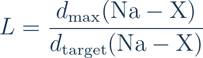

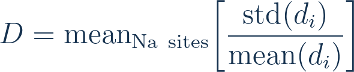

Na

Na

dmax

分子：第一配位壳层最长 Na–X 键分母：主配位数对应 Shannon 半径 + 阴离子半径

同一 Na 位点：键长标准差 / 均值再对所有 Na 位点取平均

最长键相对正常键长是否偏长

Na–X 键长的离散程度

只表示局域结构，不等于迁移势垒

过大也可能对应局域陷阱

两个组合描述符

D × L ≥ 0.040

D × dmax ≥ 0.127

畸变加权宽松比

保留绝对键长尺度

同时保留畸变和键长信息，不是两个新机制

阈值选择方法

定义快导体

遍历候选 t

按阈值分类

选择最优阈值

01

02

03

04

σ ≥ 0.1 mS·cm⁻¹

遍历每个描述符值

descriptor ≥ t

Balanced Accuracy 最大

L ≥ 1.118

D ≥ 0.043

D×L ≥ 0.040

D×dmax ≥ 0.127

<1.09

慢导体富集 ≈4%

1.118

本数据集筛选阈值

≥1.19

快导体富集 ≈77%–79%

边界：阈值是当前 103 个样本上的经验操作线，不是普适物理常数。

05 / 11

### Speaker Notes

四个初筛描述符主要来自两类信息。局域宽松因子用最长钠阴离子键除以参考键长，表示这根键相对正常配位是否偏长；多面体畸变用键长的相对离散程度表示钠配位是否均匀。两个乘积描述符只是把畸变和键长信息同时保留下来，并不是另外两个独立机制。阈值的求法是遍历候选值，比较快慢分类结果，然后取平衡准确率最高的位置，所以这些数值只适用于当前数据集。

## Slide 6

05 · 开源数据库筛选

四阈值筛出 837 个结构，复筛后保留 10 个做 DFT

四阈值筛选结果

四个筛选条件

进一步复筛

同时满足四个条件

按材料体系统计

四阈值均通过

局域宽松

L ≥ 1.118

NASICON

837

697

多面体畸变

D ≥ 0.043

硫化物

复筛条件

41

畸变加权宽松比

D×L ≥ 0.040

较大带隙 · 可能存在 Na / 空位迁移路径覆盖不同材料体系 · 没有明确电导率先例计算规模可承受

畸变加权最长键

D×dmax ≥ 0.127

卤化物

99

满足四个条件后进入材料复筛

第一轮 DFT 候选

10

837 只是四阈值筛选结果，不代表这些结构已经被证明为快离子导体或可以合成。

复筛还考虑带隙、迁移路径、文献先例和计算成本。

06 / 11

### Speaker Notes

把四个阈值同时用于开源结构后，NASICON 保留六百九十七个、硫化物四十一个、卤化物九十九个，一共八百三十七个。这里的四条线是四个同时满足的条件，不是四个逐级统计的漏斗阶段。之后再看带隙、可能的钠或空位路径、文献中有没有明确电导率报道，以及计算量是否可承受，最后留下十个材料做第一轮 DFT。八百三十七只是筛选结果，不能理解为已经发现了八百三十七个快离子导体。

## Slide 7

06 · 第一轮 DFT 材料

第一轮选择 10 个材料，分别比较四类结构中的迁移问题

NASICON｜高局域宽松和畸变是否对应低迁移势垒？

氟化物｜检查 Na⁺ 迁移，并排除 F⁻ 作为主要载流子

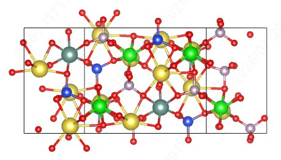

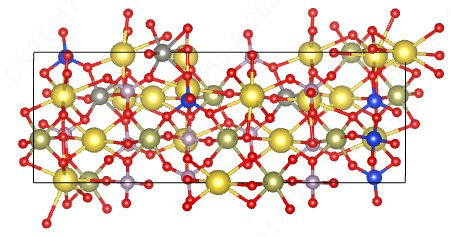

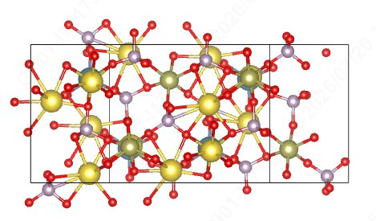

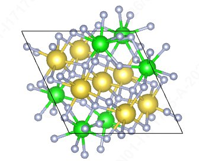

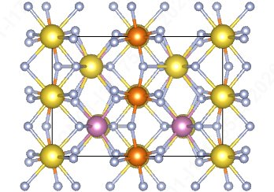

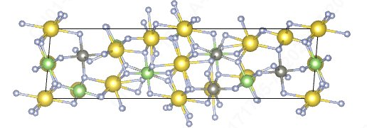

Na₃YZrSiP₂O₁₂

Na₆Hf₃ZnSi₂P₄O₂₄

Na₃CaHf(PO₄)₃

Na₇Zr₆F₃₁

Na₂MgInF₇

C2/c-Na₂ZnGaF₇

同一骨架内比较局域信号、Na 网络和刚性窗口的影响。

Cl 子集结果不能直接外推到氟化物，因此将其作为描述符边界测试。

Na 与 F 缺陷需要分别计算。

硫化物｜软晶格是否有利于 Na 迁移？

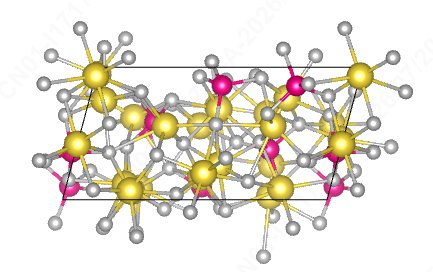

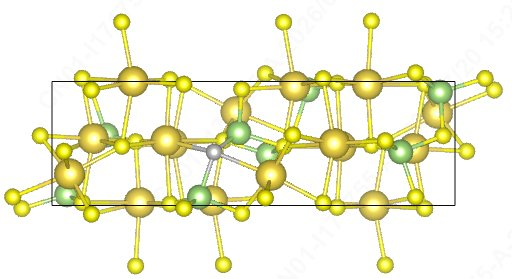

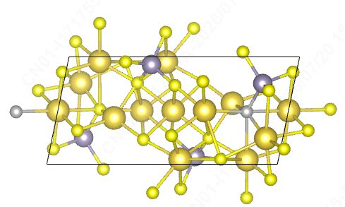

混合阴离子

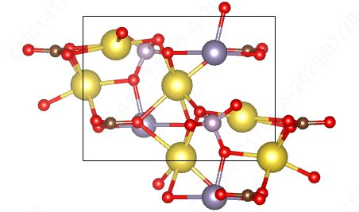

Na₃Sn(PO₄)(CO₃)

检查 CO₃ 基团的摆动 / 转动是否影响 Na 迁移路径？

Na₃TaS₄

Na₄Ga₂S₅

Na₆Sn₂S₇

还需要检查带隙和缺陷态，避免把电子导电误认为离子导电。

第一轮 DFT 先回答每个材料最关键的一个问题

结构弛豫与稳定性

缺陷 / 空位形成能

BVSE / CAVD

CI-NEB

势垒 ≤ 约 0.45 eV → AIMD

这 10 个材料不是按单一分数排名，而是兼顾正向候选、边界对照和计算风险。

07 / 11

### Speaker Notes

这十个材料不是简单按描述符从高到低排出来的。三个 NASICON 用来比较同一类刚性骨架中的局域信号和迁移路径，三个硫化物用来检查软晶格是否有利于钠迁移，同时排除电子态风险；三个氟化物还要分别检查钠缺陷和氟缺陷，确认主要迁移离子。混合阴离子材料重点看碳酸根运动会不会影响钠迁移。计算上先做弛豫、稳定性和缺陷检查，再做路径搜索和 CI-NEB，势垒足够低时再考虑 AIMD。

## Slide 8

备份 1 · 描述符定义

备份｜八个新结构描述符的计算方式和使用范围

局域键长

配位不对称

Na 位点网络

局域与网络组合

局域宽松因子

畸变均值

Na 位点连通因子

局域—连通组合

邻居数百分位 + 最大连通分量百分位，二者取均值

L = dmax / dtarget

D = mean(std / mean)

L × 连通因子

含义：最长键相对正常键长的偏离

含义：Na–X 键长离散程度

含义：同时考虑局域宽松与网络连通

含义：Na 位点网络的连通程度

范围：跨体系初筛

范围：跨体系初筛

范围：网络可计算结构

范围：网络可计算结构

≥ 1.118107

≥ 0.043210

≥ 0.577777

≥ 0.482324

两个局域量的乘积

保留最长键尺度

按 Na 浓度归一化

硫化物专用

畸变加权宽松比

畸变加权最长键

畸变密度

硫化物键长归一化

D × L

D × dmax

D / Na 浓度

mean(Na–S) / dtarget

含义：同时考虑宽松与畸变

含义：同时考虑畸变与最长键

含义：按 Na 浓度归一化的畸变

含义：硫化物中平均 Na–S 键长

范围：跨体系初筛

范围：跨体系初筛

边界：尺度敏感

边界：仅族内使用

≥ 0.040056

≥ 0.126580

≥ 2.314122

≥ 1.039905

阈值只适用于当前数据集，后续仍需用 DFT 验证。

08 / 11

### Speaker Notes

这是一页备查表，列出了八个描述符的计算方式、结构含义和使用范围。局域宽松和畸变描述局域配位，钠位点连通因子描述网络，几个乘积项保留两类信息同时出现的情况。畸变密度对钠浓度比较敏感，硫化物键长归一化也只建议在硫化物内部比较。表中的六位小数都是当前数据集得到的阈值，换数据以后需要重新计算。

## Slide 9

备份 2 · 阈值复算

备份｜阈值由平衡准确率最大值确定

局域宽松因子的三段经验区间

三个区间来自当前样本统计

<1.09

慢导体富集

1.118107

筛选阈值

≥1.19

快导体富集

平衡准确率

灵敏度

特异度

四个阈值的分类权衡

局域宽松：有效样本 102

预测快

预测慢

0.978

1.0

45

1

真实快

TP

FN

25

31

0.5

FP

TN

真实慢

局域宽松阈值只漏掉 1 个快导体，但同时保留了25 个慢导体，因此还需要 DFT 复筛。

小数精度说明

0

D×L：0.040056 → CSV 峰值 0.040058

局域宽松

畸变均值

D×L

D×dmax

D×dmax 同理：0.126580 → 0.126582

t=1.118107

t=0.043210

0.040056 / 058

0.126580 / 582

两组阈值相差约 2×10⁻⁶，是 CSV 保存精度造成的，不代表结构差异。

09 / 11

### Speaker Notes

阈值扫描以后，四个描述符的灵敏度都比较高，说明它们不容易漏掉已知快导体，但会保留一些慢导体。以局域宽松为例，一百零二个有效样本中只漏掉一个快导体，同时有二十五个慢导体也通过了阈值，所以后面必须继续用 DFT 复筛。两个乘积描述符在脚本常量和 CSV 复算结果之间相差大约二乘十的负六次方，这是保存小数位数造成的。阈值来自平衡准确率扫描，LOFO、LOAO 等方法只负责检查结果是否稳定。

## Slide 10

备份 3 · 验证方法

备份｜不同验证方法分别检查哪些问题

方法

检查的风险

能够说明什么

不用于求阈值

交叉验证

模型在不同数据划分下是否稳定？

样本内预测是否可重复

这些方法用于检查稳定性，不直接给出

Bootstrap

描述符排名是否受少数样本影响？

描述符排名的稳定性

1.118

LOFO

留出一个材料体系后，结果是否仍成立？

跨材料体系外推能力

0.043

0.040

LOAO

留出一种阴离子后，结果是否仍成立？

跨阴离子外推能力

0.127

控制已知混杂后，关联是否仍存在？

控制已知混杂后仍存在统计关联，但不能证明因果

偏相关 / DML

四个阈值来自平衡准确率扫描。

候选结构中是否存在可行迁移路径？

DFT

迁移路径及其对应势垒

统计检验用于判断描述符是否稳定；DFT 用于验证迁移路径和势垒。

10 / 11

### Speaker Notes

这张表主要用来区分几种验证方法。交叉验证看模型在不同数据划分下是否稳定，Bootstrap 看描述符排名是否受少数样本影响，LOFO 和 LOAO 分别检查跨材料体系和跨阴离子的外推。偏相关和 DML 是在控制已知混杂后再看统计关联，仍然不能证明因果。这些方法都不负责给出四个阈值，真正的迁移路径和势垒还要由 DFT 来判断。

## Slide 11

备份 4 · 候选材料

备份｜10 个候选的结构信号与第一项 DFT 问题

体系

材料

局域宽松 L

畸变 D

第一项验证问题

1.29

0.082

NASICON

Na₃YZrSiP₂O₁₂

高局域信号是否对应低势垒？

1.27

0.066

NASICON

Na₆Hf₃ZnSi₂P₄O₂₄

复杂的 Na 配位是否仍能形成连续路径？

1.32

0.066

NASICON

Na₃CaHf(PO₄)₃

磷酸根窗口会不会限制 Na 迁移？

1.28

0.048

硫化物

Na₃TaS₄

软晶格中是否出现低势垒路径？

1.18

0.051

硫化物

Na₄Ga₂S₅

链间是否存在连续 Na 迁移路径？

1.20

0.055

硫化物

Na₆Sn₂S₇

迁移计算前是否存在电子态风险？

1.28

0.057

氟化物

Na₇Zr₆F₃₁

主要迁移离子是 Na⁺ 还是 F⁻？

1.18

0.061

氟化物

Na₂MgInF₇

NaF₇ 和 NaF₈ 位点之间的迁移势垒多高？

1.15

0.072

氟化物

C2/c-Na₂ZnGaF₇

较高畸变能否对应较低 Na 迁移势垒？

1.27

0.070

混合阴离子

Na₃Sn(PO₄)(CO₃)

CO₃ 基团运动是否会降低 Na 迁移势垒？

目前这 10 个材料都只作为第一轮 DFT 候选，尚不能判断离子电导率。

表中问题决定每个材料最先做哪项计算。

11 / 11

### Speaker Notes

最后把十个材料放在一张表里，方便对应局域宽松、畸变和第一项需要做的计算。不同材料的问题不一样，有的先看路径，有的先看电子结构，氟化物还要先判断主要迁移离子。表中的问题只决定计算顺序，并不表示相应机制已经成立。第一轮 DFT 完成以后，再根据稳定性、缺陷形成能和迁移势垒决定哪些材料值得继续做 AIMD。
